<div align="center">

<picture>
  <source media="(prefers-color-scheme: dark)" srcset="docs/img/banner-dark.png">
  
</picture>

</div>

<br>

**Rosse** is a galaxy-drawing engine. Every mark it puts on the page comes from a library of real hand drawings: dots, strokes, knots, stars and whole galaxies, drawn with a fineliner, scanned and cut out. The engine builds each galaxy in three dimensions, then places, transforms and inks those drawings onto Paper or Chalkboard.

This repository is the rebuild of Rosse v21 (a single HTML page, kept in `assets/reference/` as the oracle) on **WebGPU and WGSL**, with a matching CPU engine for browsers that have no WebGPU. Every picture on this page, the banner's galaxies included, was drawn by this engine, not by v21.

| principle | in practice |
| --- | --- |
| **Hand-drawn, never procedural** | There is no generated mark. Dots, knots, strokes, cores, stars and 156 whole galaxies are scanned pen drawings; the engine only chooses where they go, how they are turned and how heavy the pen is. |
| **On the GPU** | Sampling, projection, culling, stroke expansion and merger integration run in WGSL compute passes. The CPU builds a small scene description and nothing is read back on the frame path. |
| **A CPU twin for every kernel** | Without WebGPU, TypeScript twins of the kernels run with the same random numbers, f32 arithmetic and a software rasteriser, and agree with the GPU within tolerance (`npm run test:gpu`). |
| **Deterministic** | A counter-based RNG keyed by seed, stream and index. The same seed gives the same galaxy, and orbiting the camera never re-rolls the marks. |
| **Measured against v21** | Parity is statistical (same structure, ink, pen weight and mark counts, not the same dots) and is tested against 582 captures of v21 with a calibrated metric. |

<br>

## Gallery

Every plate is a render of this engine at a fixed seed. Parameters are in [`tools/readme-assets/plan.mjs`](tools/readme-assets/plan.mjs). Where a plate has more stars or firmer arms than the preset's default, that is the engine's own parameters (`stars`, `armStrength`, `armWidth`), turned up by eye so the structure reads at this size.

<table>
<tr>
<td width="33%">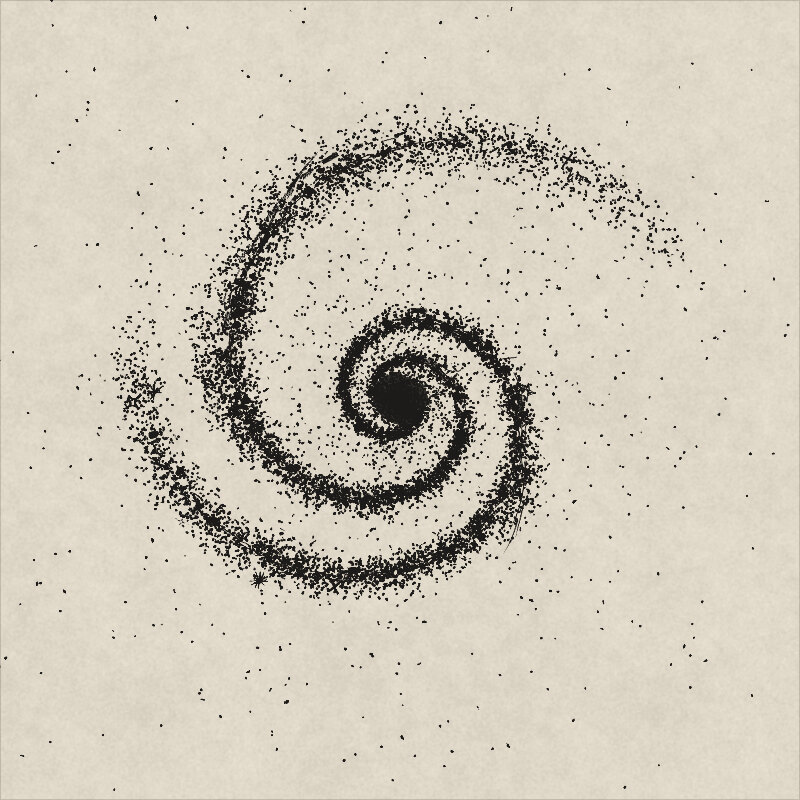<br><sub><b>01</b> &nbsp;GRAND DESIGN<br>seed 12, Paper</sub></td>
<td width="33%">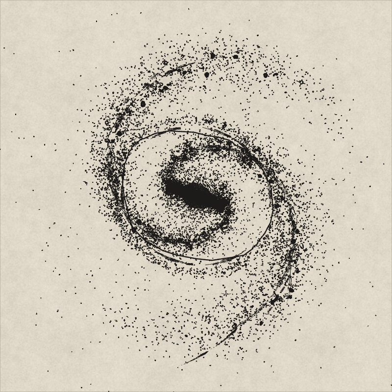<br><sub><b>02</b> &nbsp;BARRED SPIRAL<br>seed 11, drawn bar and ring</sub></td>
<td width="33%">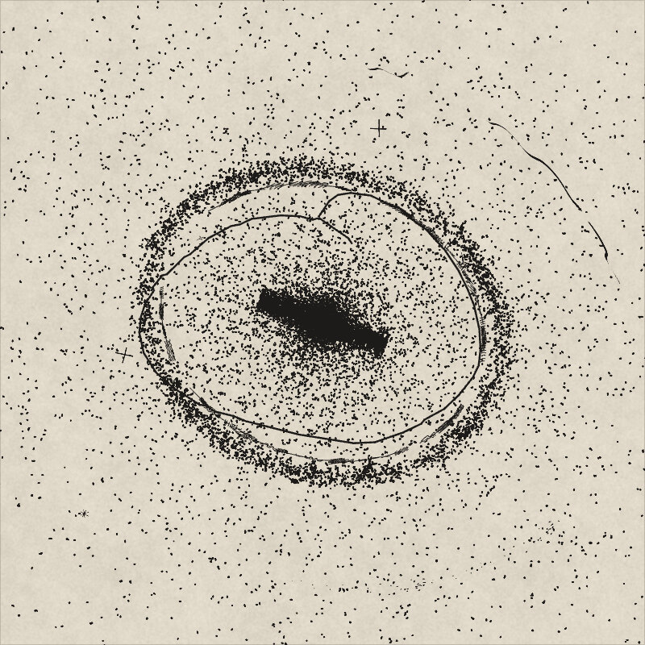<br><sub><b>03</b> &nbsp;RINGED<br>seed 3, drawn ring</sub></td>
</tr>
<tr>
<td>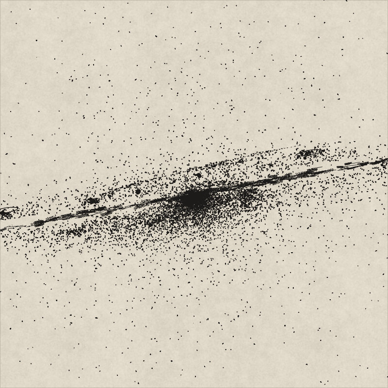<br><sub><b>04</b> &nbsp;EDGE-ON WITH DUST<br>seed 4, dust lane in pen hatching</sub></td>
<td>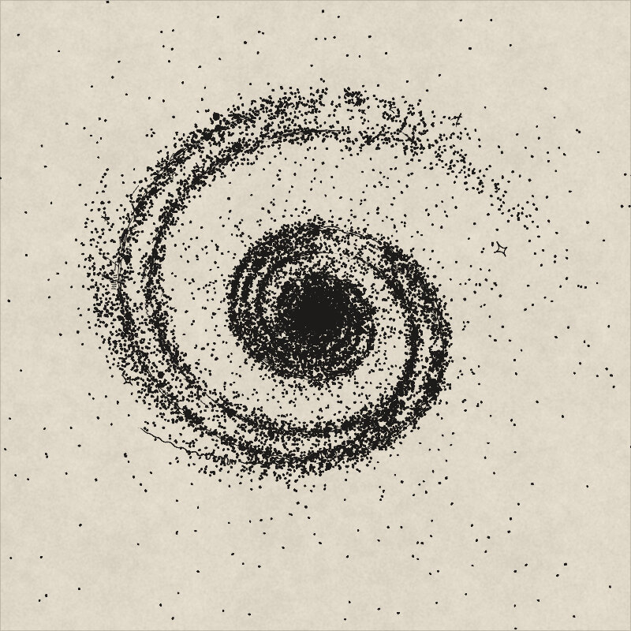<br><sub><b>05</b> &nbsp;TIGHTLY WOUND<br>seed 7, arms as stroke ribbons</sub></td>
<td>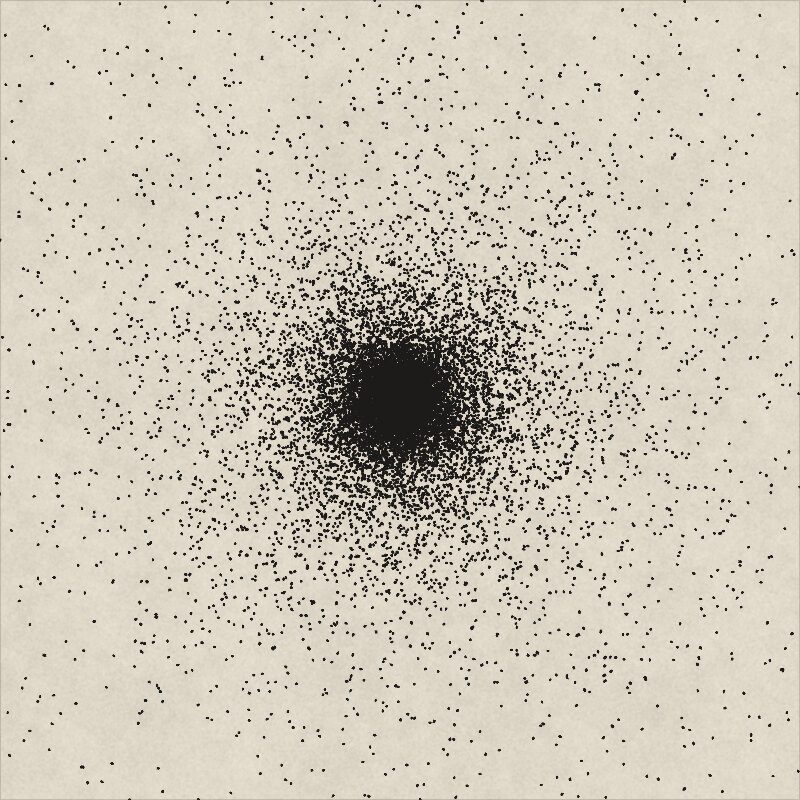<br><sub><b>06</b> &nbsp;SMOOTH, ROUND<br>seed 7, an elliptical</sub></td>
</tr>
<tr>
<td>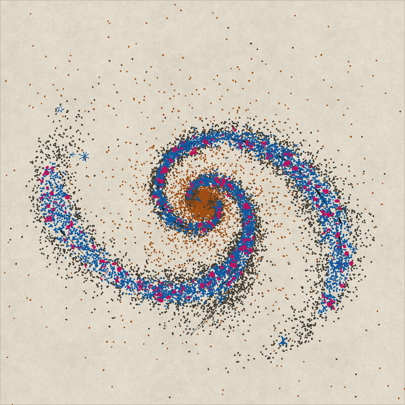<br><sub><b>07</b> &nbsp;STELLAR POPULATIONS<br>seed 7, one ink per population</sub></td>
<td>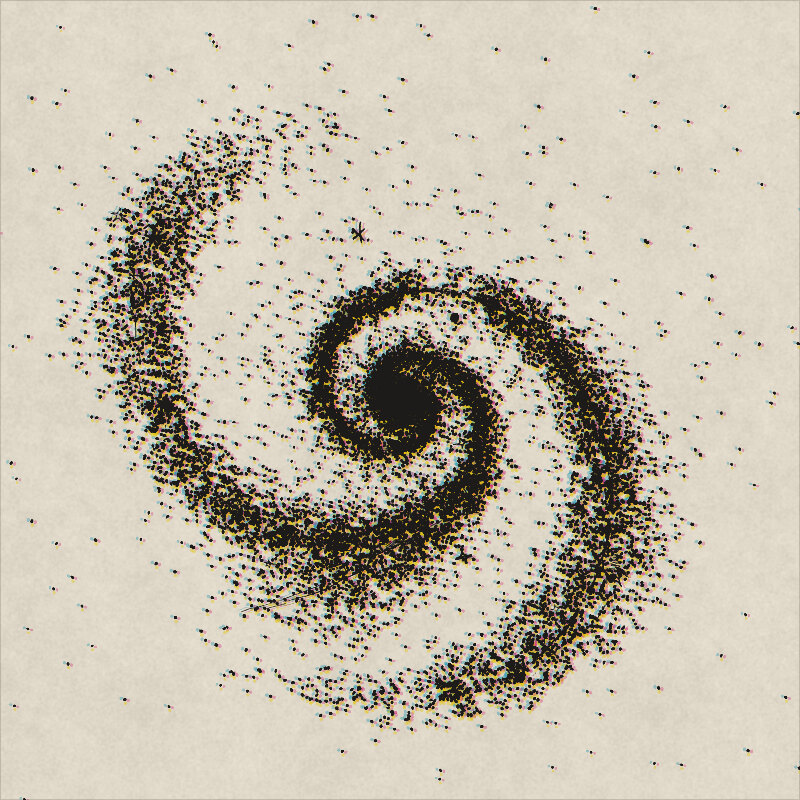<br><sub><b>08</b> &nbsp;PLATES SLIPPED<br>seed 7, misregistered plates</sub></td>
<td>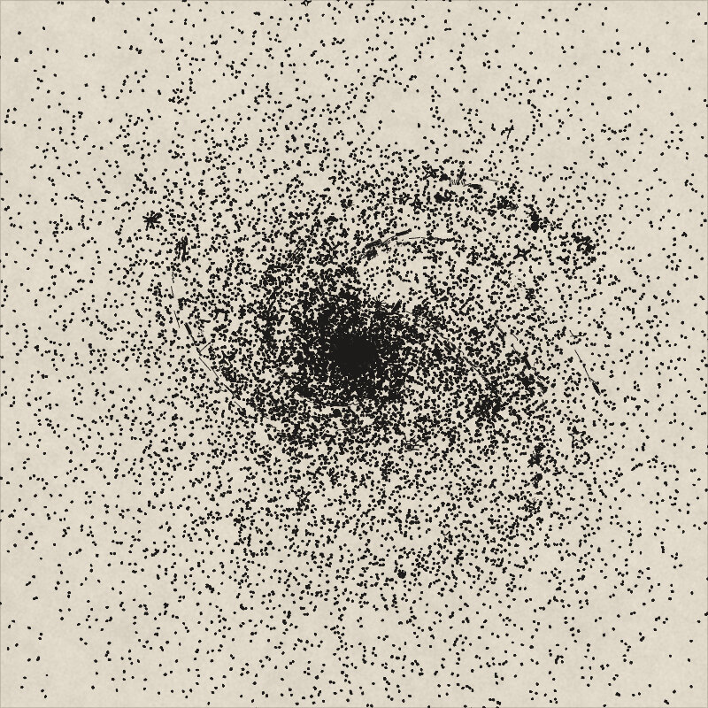<br><sub><b>09</b> &nbsp;FLOCCULENT<br>seed 7, patchy arms</sub></td>
</tr>
<tr>
<td>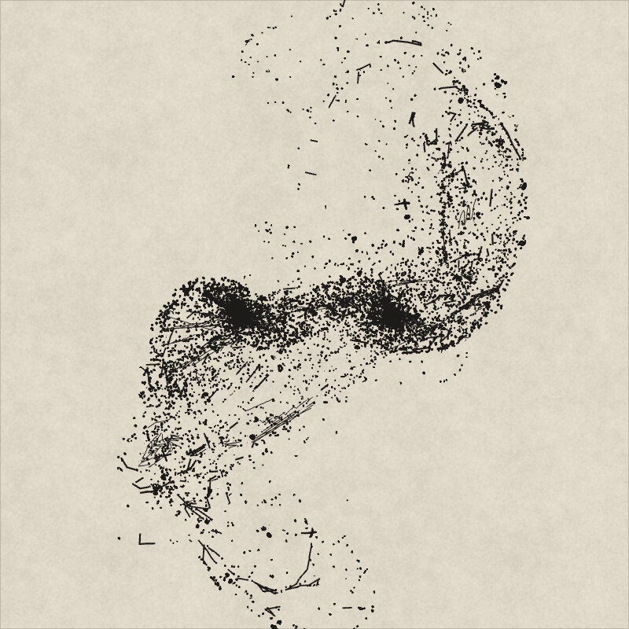<br><sub><b>10</b> &nbsp;MERGER: THE MICE<br>seed 7, simulated</sub></td>
<td>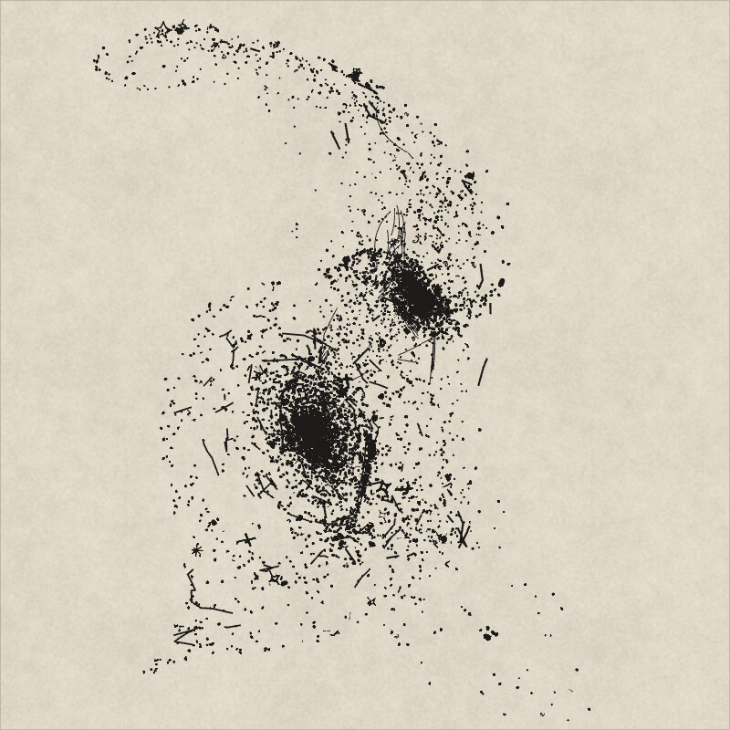<br><sub><b>11</b> &nbsp;MERGER: LONG TAILS<br>seed 7, simulated</sub></td>
<td>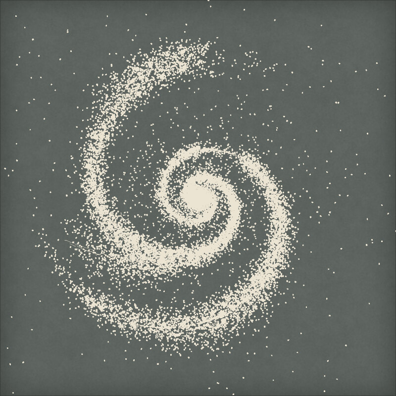<br><sub><b>12</b> &nbsp;GRAND DESIGN, CHALKBOARD<br>seed 7, the same ink on the other surface</sub></td>
</tr>
</table>

### Moving

<table>
<tr>
<td width="50%">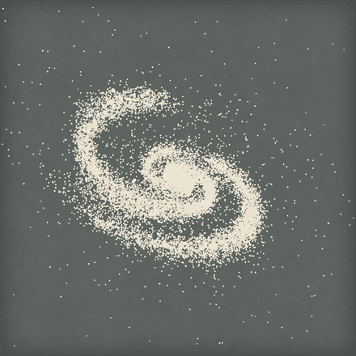<br><sub><b>ORBIT</b> &nbsp;one turn about the axis, tilted 58°. The marks are fixed in 3D, so nothing re-rolls.</sub></td>
<td width="50%">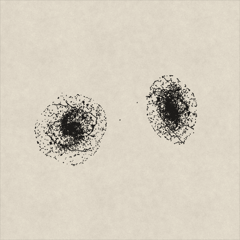<br><sub><b>MERGER</b> &nbsp;the Mice, along the simulation's timeline (<code>mTime</code> 0.04 to 1).</sub></td>
</tr>
<tr>
<td colspan="2" align="center">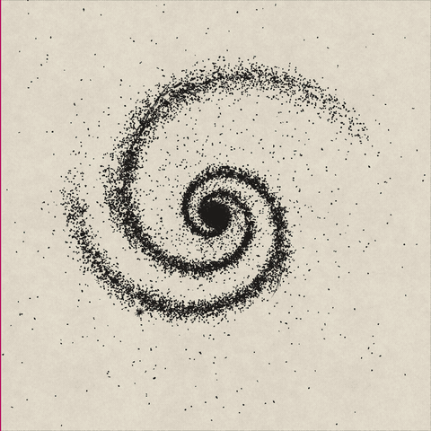<br><sub><b>SURFACES</b> &nbsp;one set of marks, composited onto Chalkboard and onto Paper. Only the last, cheap pass changes.</sub></td>
</tr>
</table>

### The pen up close

The same plate at three zooms (×1.5, ×4, ×9). Marks keep their hand: at the deepest zoom the nucleus resolves into the scanned core drawings it is made of.

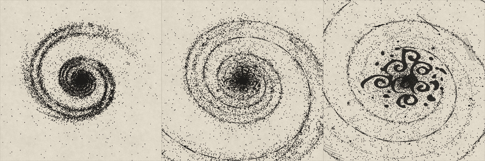

<br>

## Run it

You need Node 22 or later and a browser with WebGPU for the GPU engine (any other browser draws on the CPU engine, and says so under the plate). To validate shaders you also need [naga](https://crates.io/crates/naga-cli) (`cargo install naga-cli`).

```sh
npm ci
npm run dev        # Vite dev server: the plate, with a preset menu, a seed, Paper/Chalkboard and plates
```

The page is the engine's testbed (the full page is [M11](docs/roadmap.md), in progress). Drag to orbit and tilt, shift-drag or Q/E to roll, wheel to zoom. The URL takes `?preset=`, `?seed=`, `?az=`, `?incl=`, `?pa=`, `?zoom=` and `?backend=cpu|webgpu`; for example `/?preset=Barred%20spiral&seed=11&backend=cpu`.

| command | what it does |
| --- | --- |
| `npm test` | unit tests (vitest) |
| `npm run test:gpu` | browser tests on WebGPU (SwiftShader): RNG vectors, CPU = GPU kernels and raster |
| `npm run golden` | the golden check against v21 (see below; slow) |
| `npm run lint`, `typecheck`, `validate:wgsl`, `build` | the other CI checks |
| `npm run readme:assets` | re-draws every picture on this page ([`tools/readme-assets`](tools/readme-assets/README.md); needs `ffmpeg` and ImageMagick) |
| `npm run screenshots` | screenshots of the plate on both surfaces and both engines |

The tools that drive a browser use Playwright's Chromium (`npx playwright install chromium`) with software rendering, so no GPU is needed.

<br>

## How it is built

```
parameters ──► schema: which tier is dirty?
                 │
  model dirty ───┼─► CPU  scene description (a few kB): variation, curves,
                 │        parts, merger core track
                 │   GPU  stipple samples · merger test stars · shells
  view dirty ────┼─► GPU  project + cull → scan → instances
                 │        curves → ribbons · vectors → capsules
  present ───────┴─► GPU  ink layers in v21's order → ink target
                          → composite: Paper | Chalkboard + plates
```

| tier | re-runs when | cost of an orbit frame |
| --- | --- | --- |
| **model** | a parameter that changes the galaxy | none |
| **view** | the camera or zoom moves | the view passes only |
| **present** | the surface or plates change | one composite pass |

- **Kernels with CPU twins.** Each compute kernel in [`src/shaders/compute/`](src/shaders/compute/) (`stipple`, `scan`, `project`, `ribbons`, `vector-expand`, `merger`, `merger-sprites`, `tide`, `shells`, and more) has a TypeScript twin in [`src/fallback/kernels/`](src/fallback/kernels/) and a parity test.
- **Two ink pipelines.** Instanced quads for bitmap drawings, and analytic capsule ribbons for pen lines, into an `rgba16float` ink target; the composite blends it onto Paper or Chalkboard.
- **Determinism.** A counter-based RNG (`pcg4d`), so each sample owns its randomness and no result depends on thread scheduling.
- **Deliberate differences from v21**: orbiting keeps the marks; integer-lattice noise replaces v21's `sin`-hash noise; drawings have separate mip chains. Listed in [docs/architecture.md](docs/architecture.md).

<br>

## Status

Each milestone is one reviewable pull request. The engine draws single galaxies and mergers; the sky, lensing, the full page and the extras are still open.

| # | milestone | state |
| --- | --- | --- |
| M0 | Plan: reference notes, architecture, ADRs, v21 captures | merged |
| M1 | Paper and one bitmap mark; RNG, atlases, ink and composite | merged |
| M2 | Stipple disc from the model; the golden comparison harness | merged |
| M3 | Camera, orbit and zoom; the cache tiers | merged |
| M4 | Stroke ribbons and arms; dust lanes | merged |
| M5 | Vector marks: bars, rings, whole drawings, jets, streams | merged |
| M6 | The single-galaxy preset set; plates; Chalkboard | merged |
| M7 | Stars and artefacts; the sky | in progress (open pull request) |
| M8 | Mergers and shell galaxies | merged |
| M9 | Lensing | in progress (open pull request) |
| M10 | Performance pass on real hardware | in progress (open pull request #13) |
| M11 | The page and its UI | in progress (open pull request #12) |
| M12 | The extras: Galaxy Zoo 2 catalogue, real galaxies, SVG and GIF export | in progress (open pull request #11) |

Not yet proven: all parity numbers are measured on SwiftShader; real GPUs are measured in M10. Details per milestone are in [docs/roadmap.md](docs/roadmap.md) and [docs/milestones/](docs/milestones/).

<br>

## Testing

- **Unit tests** (vitest) cover the RNG vectors, schema and tiers, the scene description, camera maths, the WGSL resolver, struct layouts and the CPU kernels.
- **GPU tests** (`npm run test:gpu`) run the WGSL kernels and the CPU twins on the same input and compare them.
- **Golden images.** [`tests/golden/reference/`](tests/golden/README.md) holds 582 captures of v21 (ink, plate and parameters). Because v21 places dots from a sequential random stream and this engine from a parallel one, the dots land elsewhere by design, so plain pixel comparison would fail. The metric compares what must match: **total ink**, **structure** (SSIM of blurred density maps), **moments and extent**, **pen weight** (stroke widths from a distance transform) and **mark counts**, with thresholds calibrated from "same galaxy, other dots" re-draws and negative controls that must fail. The engine is also bit-exact against its own goldens on one adapter. See [tests/golden/README.md](tests/golden/README.md) and ADR [0013](docs/adr/0013-golden-image-metric.md) and [0015](docs/adr/0015-golden-metric-as-calibrated-in-m2.md).

<br>

## Documentation

| read | for |
| --- | --- |
| [docs/architecture.md](docs/architecture.md) | the WebGPU design, tiers, the hard parts and the ADR index |
| [docs/roadmap.md](docs/roadmap.md) | milestones M0 to M12 |
| [docs/reference-notes.md](docs/reference-notes.md) | how v21 works, stage by stage |
| [docs/open-questions.md](docs/open-questions.md) | decisions waiting for the owner |
| [assets/README.md](assets/README.md) | the asset pack: drawings, objects, fonts, data, and the reference page and source |
| [assets/reference/design-language/](assets/reference/design-language/DESIGN-LANGUAGE.md) | the design language this page borrows (Swiss grid, hairlines, cream paper) |
| [CONTRIBUTING.md](CONTRIBUTING.md), [CHANGELOG.md](CHANGELOG.md) | how to contribute; what changed |

<br>

## Credits and licences

- **The drawings** are the owner's own pen drawings (dots, strokes, knots, stars, whole galaxies), scanned and cut out.
- **Galaxy Zoo 2** classifications (Willett et al. 2013) are licensed [CC BY 4.0](https://creativecommons.org/licenses/by/4.0/) and must be credited. The catalogue sits in the asset pack and is used from M12.
- **SDSS** imagery for real galaxies carries the Sloan Digital Sky Survey's acknowledgement and is used from M12.
- **Fonts.** The banner is set in Heros (the files are TeX Gyre Heros, a Helvetica-like face) and IBM Plex Mono (SIL OFL 1.1, text in `assets/fonts/ibm-plex-mono/`). The handwriting fonts (Threshold Grain, Mark, Patina, Signs) are made from the owner's handwriting. Each keeps its own terms; they are listed in `assets/fonts/fonts.json`.
- **The project's licence is undecided.** Until the owner chooses one ([docs/open-questions.md](docs/open-questions.md), Q1), all rights are reserved; see [`LICENSE`](LICENSE). Third-party material in `assets/` remains under its own terms.
