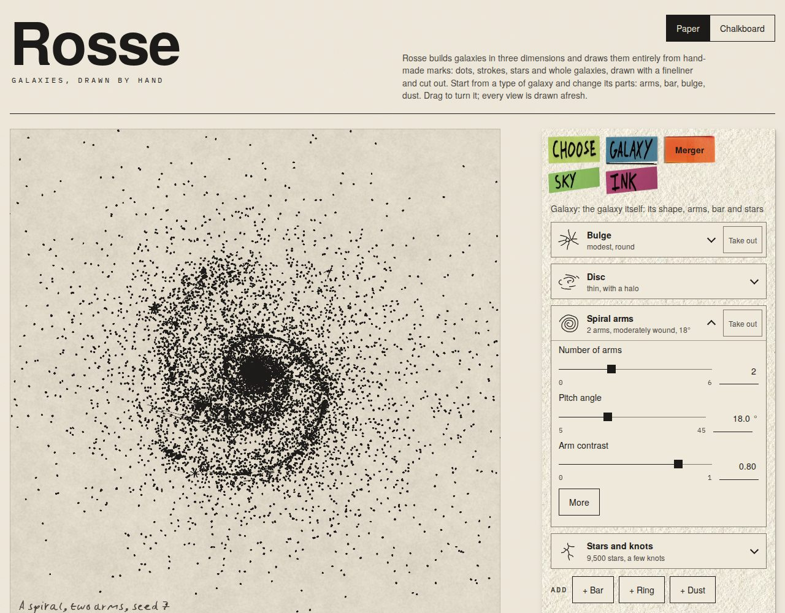
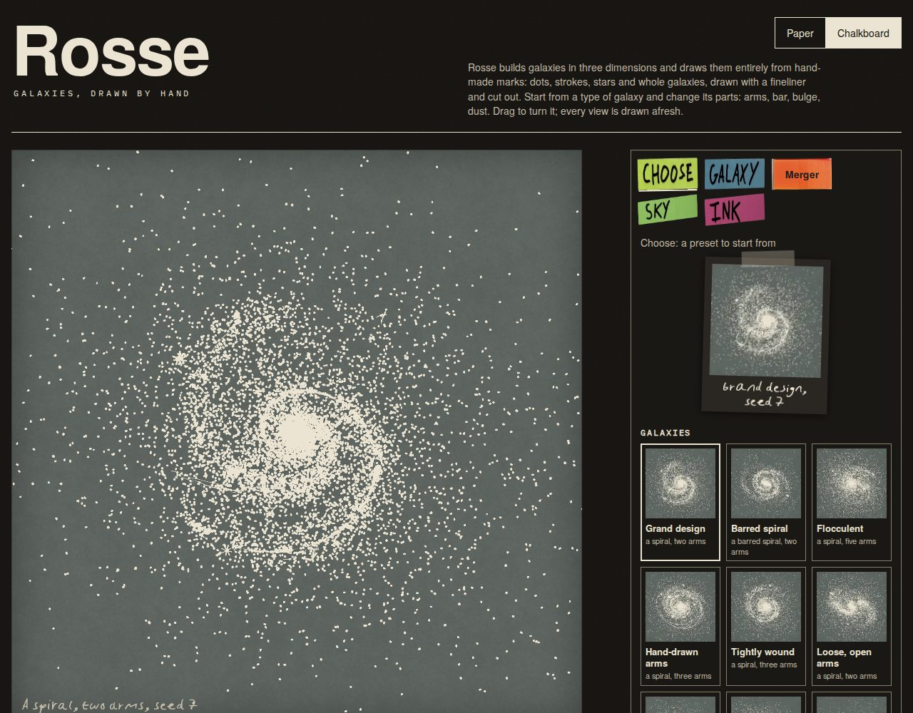
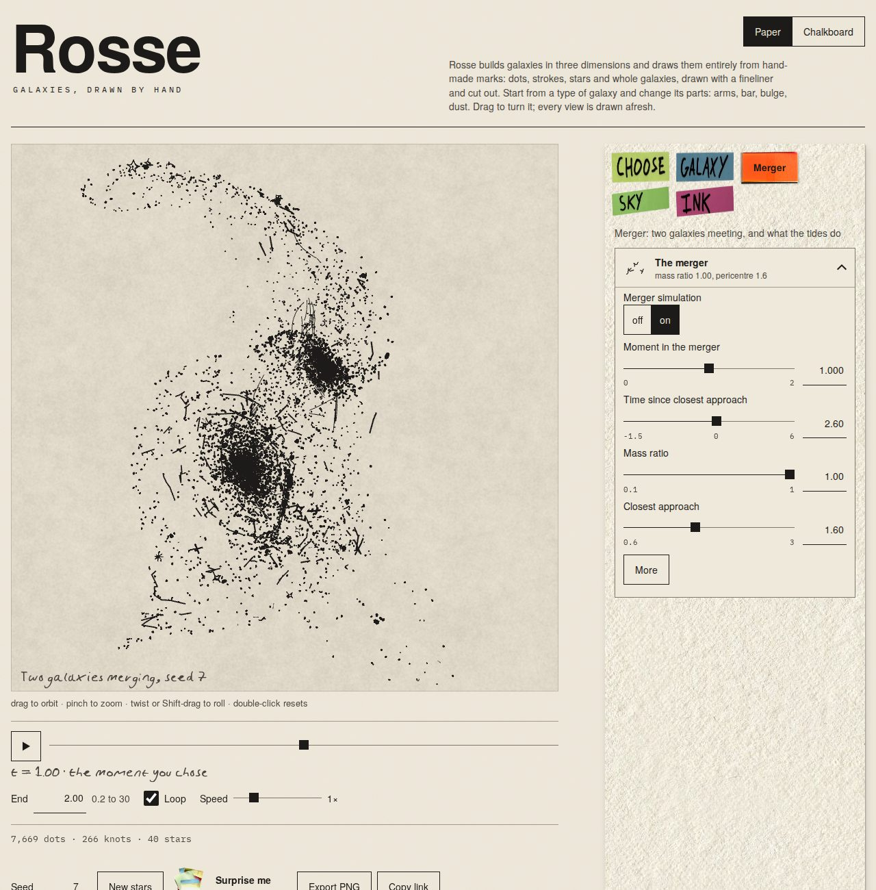
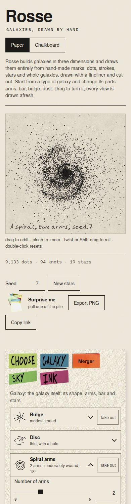

# M11: the page and UI

The page: a plate, Paper and Chalkboard, the recipe of cards (v21's, generated from the schema), preset cards with thumbnails drawn by this engine, the merger and its timeline, PNG export, a link that holds the drawing, and the "drawn on the CPU" note. It follows the design language (`assets/reference/design-language/`): type, grid and hairlines on flat cream paper with grain, hand-lettered tabs, a post-it pile, a taped print and a rail of paper as the objects v21 has, 44 px targets, a magenta focus ring, a red-pencil note only for a limit. The engines' output is unchanged (the golden hashes are the same); the merger and the shells are now drawn by the page.

| Paper, Galaxy tab | Chalkboard, Choose tab |
| --- | --- |
|  |  |
| **A merger and its timeline** | **Phone width (390 px)** |
|  |  |

## How it is built

- `src/render/capabilities.ts`: what the engines draw (`merger` on; `stars` for M7 and `lens` for M9 off). **Each engine reports it as `Engine.capabilities`, and the page reads it**: it builds controls, presets and links from it, so it cannot offer what is not drawn. M7 and M9 switch their flag on in the pull request that wires their drawing into the page; their controls, tabs and presets appear with it.
- `src/ui/layout.ts`: v21's components (`COMPONENTS`, app23.js:L1456) laid over the schema, in their tabs: the schema gives every control its kind, range, step and unit, and the layout says where it sits and what the card's summary says. A unit test fails if a schema entry with `control: true` is placed in no card or twice.
- `src/ui/controls.ts`: the recipe. A card has an icon (one of the library's own pen drawings, `icons.ts`), a name, a summary of its settings in words, its main controls and "More"; a part that can be left out has "Take out" and an "Add" button in its tab; the Merger tab has one card whose controls are disabled until the merger is on. Controls are sliders (native `input[type=range]` and a typeable value, clamped), radio groups up to three options and a menu for more, and v21's off/on buttons for `lines`, `whole`, `envelope` and `outline`.
- `src/ui/page.ts`: the state the viewer edits, reported to `main.ts` through one `onChange` with a **kind**: `params`, `preset` (a preset, a new seed, Surprise me), `camera`, `surface`. The overlays' home orientation (open question Q3) is set again for `preset` only, never when a View control moves; M7 and M9 read `wanted.home` (`window.__rosse.home` for tests).
- `src/main.ts` drives the merger and the shells in the frame path. `Engine.draw` is asynchronous: a merger's model tier (`GpuMerger.build`, the integration in chunks) is built inside the frame queue, so the previous frame stays on the plate meanwhile, the page says "Simulating the merger…", and `snapshot` (PNG), further frames and surface changes wait their turn. The model tier is keyed on every parameter except the camera, `mTime`, the winding and the plates (`src/render/page-key.ts`), so the timeline and the orbit only run the view tier (`tests`: the scrub runs no model tier). If the device is replaced during a build the frame fails like a lost device and is drawn again. The CPU engine builds on the main thread (it blocks while it does: M10 moves it to a worker). Shell galaxies' simulated shells are built the same way.
- `src/ui/urlstate.ts`: the link holds `preset` (or `from`, for M12's galaxies), `seed`, the camera, `surface` (always: a link means the same on a viewer whose own choice or colour scheme differs) and every parameter that differs from the preset, including `mTime` and `mHorizon` up to 30. Reading clamps numbers, ignores bad choices, **drops a preset or parameter the engine does not draw**, and leaves `backend`, `present` and `variant` alone. `?features=` is gone.
- `src/ui/timeline.ts`: play, scrub, end, loop and speed as v21's (6 s per unit of t at 1×). The moment is kept inside 0 and the end (v21's `tlSetEnd`), the horizon follows the end, and the schema's `mTime` now runs to 30 (owner decision of 2026-10-07; the one deliberate difference from the reference's ranges in `tests/unit/params.test.ts`). The address is written at most four times a second, so it follows a playing timeline. It never starts by itself, and loops by default only when the viewer has not asked for reduced motion.
- `tools/thumbnails/make.mjs` (`npm run thumbnails`): draws every preset the page offers with this engine (seed 7, the preset's own camera, the middle three quarters of the plate at 192 px, WebP) on Paper and on the Chalkboard into `src/ui/thumbs/`. Run it again when M7 or M9 add presets. The thumbnails are this engine's own picks, not v21's captures.
- Objects (`src/ui/art/`, small files from v21's own embedded pictures): the hand-lettered tabs (the word is the button's accessible name), the rail of paper under the panel, the post-it pile of "Surprise me", and the taped print of the preset being drawn (`.print`, also for M12's real galaxies).
- Fonts: `assets/LICENCES.md` records what the pack says of each.

## Checklist: v21's controls

Status: **done**, **waits for M7 / M9** (built from the schema; appears when the engine's capability is on), **M12** (left out on purpose), **changed**.

| v21 control | status |
| --- | --- |
| Presets, grouped (galaxies, mergers, lenses, stars and artefacts, scenes, creative) | done, with this engine's thumbnails (28 now); the lens presets are in (M9, 8 more thumbnails); the star and artefact presets wait for M7 |
| Surprise me (the post-it pile) | done (star and artefact additions wait for M7); `?variant=` overrides apply |
| New stars, seed | done (the seed box takes 1 to 9999) |
| Recipe cards: What it is, Bulge, Disc, Spiral arms, Bar, Ring, Dust, Stars and knots | done; "What it is" (galaxy, star, artefact) waits for M7 |
| The star or artefact; A foreground star; An artefact | wait for M7 |
| Camera (inclination, orbit round the axis, roll), winding | done; the plate orbits, rolls and zooms by pointer and keys (M3) and the sliders follow it |
| Companions and oddities | done (foreground stars wait for M7) |
| The deep field | bubbles, streams, hand wobble done; the deep field itself waits for M7 |
| Pen, Stars and dust (hatching), The drawings, Print (plates) | done (drawn stars wait for M7) |
| Lensing, the quasar flare | done (M9: `capabilities.lens` on; the quasar's flare runs on the timeline through `mTime`, a view-tier input) |
| Shells (simulated) | done (drawn by the page since M11) |
| The merger: moment, ratio, approach, time since closest approach, tilts, friction, arms, sizes, orbit tilt, speed, stars simulated, galaxy types, merger on, tearing | done |
| Timeline: play, scrub, end (0.2 to 30), loop, speed | done |
| Paper and Chalkboard (v21's dark mode) | done, remembered, and in the link |
| PNG export | done (v21 had none): the plate's drawing at its pixel size, without the caption written over it on the page |
| URL state | done (v21 had none) |
| "Drawn on the CPU" note | done (`#note`, red pencil, announced as a status) |
| Plate caption, "drag to orbit" hint, double-click reset | done |
| Recipe rail, hand-lettered tabs, post-it pile, taped print | done (see Objects) |
| Export SVG, Export GIF | M12 |
| Any Galaxy Zoo 2 galaxy (random by type, find) and real galaxies with photos | M12 |
| Line strokes, whole drawing, halo or disc drawing, outline arcs | changed: v21's off/on buttons, and any value above 0 reads as on (a preset's 0.9 shows "on"); links and presets keep the exact value |

### Not buildable yet

- **M7**: the star or artefact, in the field, the deep field, foreground stars, drawn stars among the dots, and the presets that use them.
- **M9**: the lens, the quasar flare and the lens presets.

## Integration points for M12

(PR #11 asked for these; M11 provides the interfaces and leaves the buttons and the catalogue UI to M12.)

1. **Export hook.** `ExportSource` (`src/ui/export.ts`): `backend()`, `snapshot()` (the plate as pixels), `layers()` (the last drawing's ink layers, for an SVG that reads buffers back on demand) and `device()` (the GPU device, or null). `Page.addExport({ id, label, run(source, page) })` adds a button after Export PNG and handles busy and errors. The engine itself stays private to `main.ts`.
2. **Timeline accessors.** `Page.timeline()` gives `{ end, speed, loop, playing }`; `Page.state().P.mTime` and `mHorizon` give the rest, and a GIF re-draws moments by setting `mTime` through the page.
3. **A galaxy that is not a preset.** `PageState.preset` may be `null` with `PageState.from` a string naming the galaxy (`gz2:<id>`, `real:<n>`); the link writes `?from=` and every parameter that differs from the defaults, and `parseUrlState` returns `from` for M12 to load. The address bar no longer fails silently: if it cannot be updated the page says so once in the status line and the console.

## Accessibility

- Every control has a visible label tied to it (`label for`, or a `fieldset` with a `legend` for a group of radio buttons); the number box of a slider is named `<label>, value`; a hand-lettered tab's word is its accessible name. The Playwright test checks every input, select, button and tab of every panel, hidden and closed ones included, has a name.
- Keyboard: the page is reachable in reading order (skip link, surface, plate, seed, buttons, tabs, panel), and the test presses Tab through it and checks the order. Sliders take the arrow, Home, End and Page keys; tabs take Left, Right, Home and End; the plate takes the arrows, Q and E, plus and minus, 0 (M3); typing in a number box does not turn the plate. A card header is a button with `aria-expanded`.
- Focus is a 2 px magenta ring on every control; the test checks it on what the keyboard reaches, a slider, a card header and a tab included. Targets are at least 44 px high.
- Contrast (`tests/unit/ui-contrast.test.ts`, WCAG 2.x): all text and both inks are at least 4.5:1 on both grounds, and **the edge of every control** (a slider's track, a card's border) at least 3:1 (`--edge`, 3.6:1 on Paper and 4.6:1 on the Chalkboard). The lighter hairline (`--hair`) is used only for decorative rules between parts, never as the only boundary of a control.
- Reduced motion: no transitions or animation; the timeline never plays by itself and does not loop by default.
- Live regions: the mark counts, the CPU note, the status line and the plate's caption are written only when their text changes (a test counts the mutations over three surface changes: none).
- Forced colours: the selected states use `Highlight`, and the slider's track and thumb, which the page draws, are kept in system colours (the test checks the pixels of the slider under forced colours).
- A group that is switched off is a disabled `fieldset`, announced as unavailable, with a line saying what turns it on.

### Not tested

A real GPU; phones and touch; a screen reader; any browser other than Chromium; 200% zoom. The plate itself has no text alternative beyond its caption and the mark counts.

### Testing limits

`vite preview` and `vite dev` answer HTTP 431 to a URL of more than about 16 KB (Node's header limit). A link carries only what differs from its preset, so this matters for hand-built addresses, not for the page's own.

## Tests

- `tests/unit/ui-page.test.ts`: the layout places every schema control once and hides the gated ones; presets follow the capabilities; links round-trip (both surfaces, `mTime` and `mHorizon` to 30, a galaxy with a source), clamp, drop what the engine does not draw and keep the page's own keys; the timeline's clock; Surprise me draws afresh (seeds, presets, looks and v21's ranges, over 300 draws).
- `tests/unit/ui-contrast.test.ts`: the colour tokens and the edges of controls.
- `tools/gpu-test/ui-smoke.mjs` (`npm run test:ui`, and in `npm run test:gpu`), on the CPU engine and on WebGPU: the checks listed at its head, on pixels: a slider changes the plate; a merger has two concentrations of ink and a single galaxy one; the scrub changes the picture and runs no model tier; the PNG is the plate's size and the two engines' PNGs agree (mean difference 0.00 of 255); with a dark colour scheme and storage blocked a link keeps Paper or the Chalkboard; names, keyboard order and focus rings; forced colours; the home orientation. `tools/gpu-test/plates-page.mjs` drives the Plates choice in the Ink tab.

## Owner decisions taken (2026-10-07)

1. **Fonts**: Threshold Grain is the owner's own handwriting (unrestricted); the others are listed in `assets/LICENCES.md` as the pack gives them (IBM Plex Mono: OFL 1.1 with its text; Heros: no licence file in the pack, its files name TeX Gyre Heros under the GUST Font License, not checked here). The project licence is still undecided (Q1).
2. **Thumbnails and objects**: rebuilt as above.
3. **The merger on the page**: wired; `capabilities.merger` is on.
4. **`mTime` follows the horizon** to 30.

## Left open

- M7 and M9 each: switch their capability on in the pull request that wires them, regenerate the thumbnails (`npm run thumbnails`), and attach their `home` to `wanted` where `home` is set today (`kind === 'preset'`).
- The CPU engine's merger blocks the main thread while it integrates (M10: a worker).
