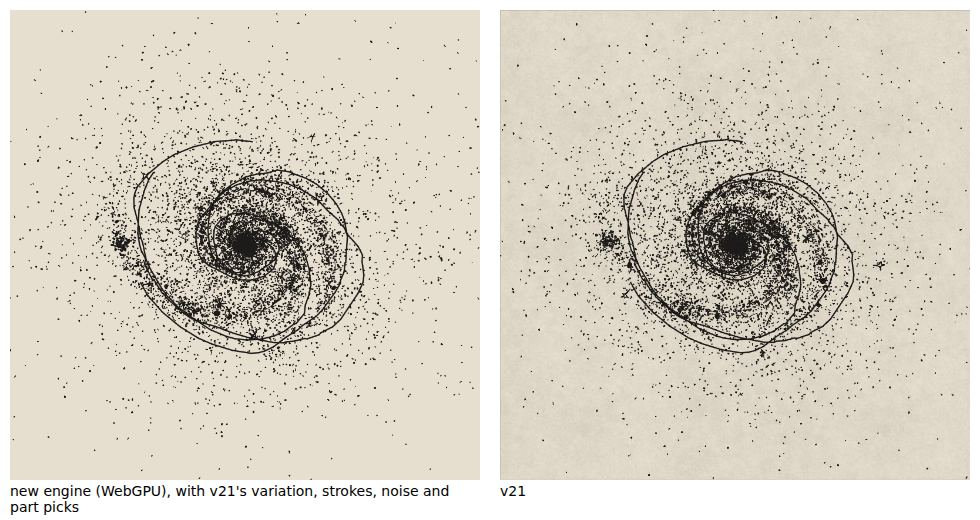
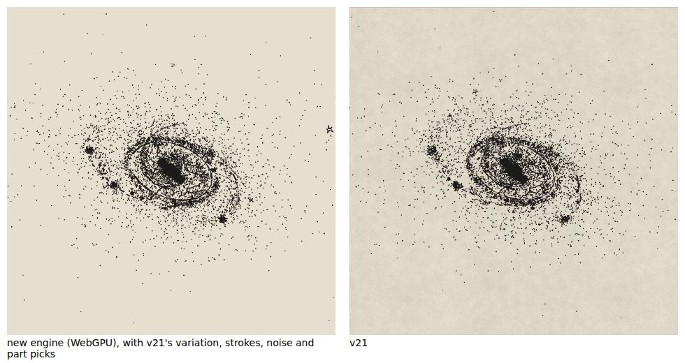
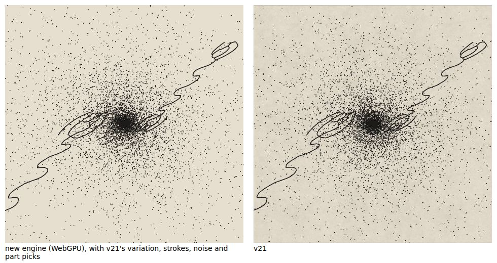

# M5: vector marks

The drawn parts are drawn: envelopes, whole drawings (rewound to the galaxy's pitch), drawn arms, bars and rings, bubbles at the clumps, the nuclear spiral, arcs, shells, the tail, trails and cosmic rays, the arrow, the jet and the stellar streams, every one a hand-drawn vector drawing expanded into pen capsules, dots and blobs on the GPU. All numbers below are from Chromium 141 with WebGPU on SwiftShader (Playwright 1.56.1) and the CPU engine in Node 22.

| new engine (WebGPU) beside v21 | |
| --- | --- |
| `Hand-drawn arms`, seed 7, home |  |
| `Barred spiral`, seed 4242, orbit camera |  |
| `Radio jet`, seed 7, zoom 2 |  |

These are the `vectors` variant (below), drawn as the golden runner draws them, with v21's variation, stroke choices, noise and part picks, so both sides show the same galaxy (`node tools/gpu-test/side-by-side.mjs --set m5`; the new engine's ink is shown over the plate's field colour). The page (`?variant=vectors`) draws the same presets with the engine's own picks.

## What is built

- **The library on the GPU** (`marks/vector.ts`, ADR 0006): all 12 vector sheets (429 drawings) packed once into shared tables: 23,431 segments, 6,038 dots and 328 blobs, a per-drawing range table, and the prefix of each segment's densified piece count (86,280 pieces at ≤ 0.012 tile units, used only under a warp). The packer copies every sheet with its metadata (packer 4).
- **Parts placement as scene description** (`model/parts.ts`):
  - The model tier (`describeParts`) makes every choice of v21's `parts()` (L987–1086) by v21's rules:
    - envelopes, halo or disc;
    - whole drawings matched to the type (`wholeTypeOf`: the structure predicates of ADR 0017, including L1000's `smooth:elongated`), with v21's doubled spiral pool;
    - drawn arms by tightness class, each copying the first or not;
    - non-solid bars, rings, the nuclear spiral;
    - arcs, drawn shells, the tail's pen line;
    - trails and cosmic rays and the field-gated arrow, at v21's fixed plate positions (v21 parity: they ignore the zoom, reference notes 20.15);
    - bubbles (a `rings` curve at a clump, with probability 0.6 · bubbles), the jet (the `misc` spring, both ways);
    - the streams (a pen line's longest polyline bent round the galaxy, in the plate: v21 parity, it ignores the camera).

    Each part has its own index on the `parts` stream (`PartIndex`), so turning the jet on no longer changes the bar.
  - The view tier (`vectorRows`) lays out v21's rows `[x, y, tile, alpha, m, ps, warp]` for a camera (`discM`, the scale, the bubbles' projected clumps), in the `MAGNIFIED` order, a few dozen per galaxy.
  - The drawn core of M2 is extended with the nuclear spiral (`coreInstances`).
- **`compute/vector-expand.wgsl`** with its CPU twin `fallback/kernels/vector.ts`:
  - `expand_caps`: one capsule slot per segment, or, under a warp, per densified piece. Its instance is found by binary search on the slots, its piece by binary search on the densified prefix. Both ends go through `tf`: the warp, the column-major matrix and translation, then the hand wobble. The capsule's half width is `PEN.line/2 · ps` plate px (spike variant A2's coverage).
  - The warps:
    - `rewind`, θ += dk · ln(r/0.08), mirrored first for a Z-wise drawing, nothing within 0.015 of the centre (`rewindFn`, L842–845), turned by `cos_f`/`sin_f` with no `atan2`;
    - a generic `post` hook (a plate affine about a centre) for the tides and lens Jacobians of M8 and M9.

    Under a warp, segments longer than 22 px are dropped; under `post`, also those stretched more than 1.8× (L1207–1208).
  - `expand_dots`: a vector dot becomes a `dots` sprite from the hand, `VAR.dotPool[|round(997x + 131y)| % len]`, sized `dotSprite(t, clamp(2r·sc·0.42/2.6, 0.8, 1.6)·max(0.55, ps))`.
  - `expand_blobs`: a blob becomes a `knots` sprite, `VAR.knotPool[|round(991 cx)| % 24]`, with the matrix `M·R(θ)·S(max(1.7 rx, 3/sc), …)`.
  - `stream_marks`: the streams' dots and knots, one slot per 2.4 px of the bent pen line, kept with probability 0.55 + 0.45 · streams, one in 25 a knot, jittered by 1.4 px, on their own stream (`partMarks`) keyed by the placement key.
  - Two deterministic compactions (`scan_local`, `scan_blocks`, scatter; ADR 0004): the kept capsules, and the streams' dots and knots, in slot order, with indirect draw arguments. Capsules are drawn with `drawIndirect` (`[6n, 1, 0, 0]`); the stream marks as indirect sprites.
  - v21 parity: every vertex, dot and blob is drawn at alpha 1, whatever the row's alpha (reference notes 20.10: the ring at 0.55 is drawn at full strength).
- **Draw order** exactly as `scene()` (L1289–1301): stroke ribbons; every vector drawing's lines, dots and blobs (the hatching's, then the parts'), in line ink; pieces; the stipple's old, disc and young dots; the streams' dots and knots (old ink); knots; sparkle stars; the core and the nuclear spiral (old ink). v21 expands every vector sheet, the bars, rings and arcs included, into the one line-ink layer and empties their own sprite layers (L1287), so they are drawn there and not in `old` or `young` ink.
- **Both engines** draw the same layers (`GpuStipple.inkLayers`, `CpuStipple.view`).
- **The used-drawings count** (`model/used.ts`): the sources v21's `USED` collects, counted from what the CPU engine draws. It does not yet count the drawn stars (M7) or the carving lines' pen lines.
- **The page** draws every part with the engine's own picks (`?variant=vectors` gives the golden overrides).

## Acceptance

### The golden set and its overrides

Roadmap M5: `Hand-drawn arms`, `Ringed`, `Disc, no arms`, `Barred spiral` (with its drawn bar and ring), `Edge-on with dust`, `Radio jet` (with the jet), `Stellar streams`, `Shell galaxy` (its drawn part), seeds 7 and 4242, home, orbit and zoom (home at zoom 2). 48 v21 captures, variant `vectors` (`tests/golden/extra-cases.json`, captured with `npm run capture:reference -- --extra tests/golden/extra-cases.json --variant vectors`). Every override, and why (ADR 0022, proposed):

| override | why |
| --- | --- |
| `starMix: 0` | drawn stars among the stipple are vector `sstars` placed by `generate()` (M7). The ring knots' and clumps' drawn stars stay, because v21 draws them whatever `starMix`. Both sides classify and count them (`rstars` 15/15 for `Ringed`, 9/9 for `Barred spiral`); they are not drawn yet |
| `field: 0`, `fgstars: 0` | the deep field and the foreground stars (the sky, M7). `field: 0` also turns off the arrow, which v21 draws only in a deep field |
| `Shell galaxy`: `shellsOn: 0`, `shells: 1` | its simulated shells are an N-body integration (M8). Its drawn part is the `shells` sheet, which the preset leaves at 0 |

Not overridden: envelopes, drawn arms, the drawn bar and ring, bubbles (v21's default 0.4, at the clumps of every preset with arms), the jet, the streams, the ribbons, the dust lanes and their hatching, and the core.

### What the comparison draws with (ADR 0021, proposed)

M2 and M4 draw with v21's replayed variation, strokes and noise. The runner now also draws with v21's **part picks** (`compare/v21-parts.ts`). These are `parts()`'s draws replayed on v21's own stream `mulberry32(seed · 57 + 3)`, at the capture's zoom, including the streams' mark draws that sit between one stream's picks and the next.

`tests/unit/parts.test.ts` checks the replay against v21's own `parts()`, cut out of app23.js and evaluated as written. It runs 17 configurations (the M5 presets, and parameter sets with every part on) at 4 cameras, and requires:

- the same drawings in the same order;
- the same positions and matrices, to 10⁻⁶;
- the same pen scales and rewind warps;
- the same cores and nuclear spiral;
- every v21 stream mark within 6.3 px of the engine's streams.

`tests/unit/parts-distribution.test.ts` checks the engine's own picks against v21's over 2,000 seeds: a χ² test at 0.1% for every choice of drawing and every count, and 4 standard errors for every spin, size and place. The engine's own picks are printed as `own var.`.

The thresholds were recalibrated with the M5 cases among the configurations (`npm run golden -- --calibrate`: 274 configurations × 6 re-keys and 3 stand-ins plus the negative controls, against 142 in M4). The per-preset axis-ratio tolerances now cover `Hand-drawn arms` and `Stellar streams`, and at the zoom camera also `Ringed`, `Edge-on with dust`, `Radio jet` and `Shell galaxy`.

### Results (WebGPU against v21; the CPU engine gives the same numbers)

| case | ink | coarse SSIM | median | p90 | r50 | dots | knots | stars | rstars | result |
| --- | --- | --- | --- | --- | --- | --- | --- | --- | --- | --- |
| barred-spiral s4242 home | 1.0% | 0.948 | -0.7% | 2.7% | 0.2% | 9340/9373 | 143/128 | 13/12 | 9/9 | pass |
| barred-spiral s4242 orbit | 0.8% | 0.950 | -0.3% | 0.4% | 0.6% | 9288/9309 | 141/132 | 12/11 | 9/9 | pass |
| barred-spiral s4242 zoom | 0.6% | 0.937 | 0.0% | -1.4% | 0.2% | 9340/9373 | 143/128 | 13/12 | 9/9 | pass |
| barred-spiral s7 home | 0.2% | 0.931 | 0.4% | 1.2% | 1.0% | 9550/9564 | 180/177 | 11/9 | 9/9 | pass |
| barred-spiral s7 orbit | 0.4% | 0.934 | 0.6% | 0.5% | 0.4% | 9515/9535 | 179/167 | 11/9 | 9/9 | pass |
| barred-spiral s7 zoom | -0.0% | 0.916 | 0.3% | 1.0% | 0.7% | 9550/9564 | 180/177 | 11/9 | 9/9 | pass |
| disc-no-arms s4242 home | -0.2% | 0.929 | 0.5% | 0.3% | 0.3% | 9470/9469 | 0/0 | 0/3 | 0/0 | pass |
| disc-no-arms s4242 orbit | 0.3% | 0.953 | 0.4% | -0.1% | -0.4% | 9470/9469 | 0/0 | 0/3 | 0/0 | pass |
| disc-no-arms s4242 zoom | -0.6% | 0.909 | -0.6% | 0.5% | -1.0% | 9470/9469 | 0/0 | 0/3 | 0/0 | pass |
| disc-no-arms s7 home | -1.5% | 0.919 | 0.6% | 1.3% | -1.9% | 9448/9442 | 0/0 | 0/1 | 0/0 | pass |
| disc-no-arms s7 orbit | -1.2% | 0.939 | 0.0% | 0.5% | -2.0% | 9448/9442 | 0/0 | 0/1 | 0/0 | pass |
| disc-no-arms s7 zoom | -0.6% | 0.906 | 0.5% | 0.7% | -1.9% | 9448/9442 | 0/0 | 0/1 | 0/0 | pass |
| edge-on-with-dust s4242 home | 0.3% | 0.965 | -0.5% | -1.5% | 2.3% | 3372/3377 | 83/87 | 3/1 | 0/0 | FAIL r25 3.41% (±3.00%) |
| edge-on-with-dust s4242 orbit | -0.4% | 0.952 | 0.2% | -0.5% | -1.5% | 5653/5695 | 108/83 | 10/13 | 0/0 | FAIL position angle 1.53° (±1.45°) |
| edge-on-with-dust s4242 zoom | -1.0% | 0.963 | 0.1% | 0.1% | 2.6% | 3372/3377 | 83/87 | 3/1 | 0/0 | pass |
| edge-on-with-dust s7 home | -0.5% | 0.962 | 0.1% | 4.6% | -1.1% | 3511/3484 | 119/137 | 4/3 | 0/0 | pass |
| edge-on-with-dust s7 orbit | 0.3% | 0.941 | 1.5% | 0.4% | -0.1% | 5830/5836 | 141/151 | 10/13 | 0/0 | FAIL axis ratio -0.0308 (±0.0300) |
| edge-on-with-dust s7 zoom | -0.9% | 0.962 | 0.5% | 3.0% | -2.5% | 3511/3484 | 119/137 | 4/3 | 0/0 | pass |
| hand-drawn-arms s4242 home | -0.6% | 0.941 | 0.7% | 0.1% | -0.2% | 9118/9133 | 166/187 | 21/23 | 0/0 | pass |
| hand-drawn-arms s4242 orbit | -0.7% | 0.943 | 0.9% | 0.7% | 0.3% | 9055/9080 | 165/187 | 20/25 | 0/0 | pass |
| hand-drawn-arms s4242 zoom | -0.4% | 0.929 | -0.6% | -0.9% | 1.0% | 9118/9133 | 166/187 | 21/23 | 0/0 | pass |
| hand-drawn-arms s7 home | -1.0% | 0.935 | -0.6% | -0.7% | -0.2% | 9217/9216 | 107/115 | 21/20 | 0/0 | pass |
| hand-drawn-arms s7 orbit | -0.3% | 0.941 | -0.5% | 0.5% | -1.7% | 9148/9135 | 106/114 | 21/17 | 0/0 | pass |
| hand-drawn-arms s7 zoom | -0.8% | 0.921 | -0.4% | -0.1% | 0.8% | 9217/9216 | 107/115 | 21/20 | 0/0 | pass |
| radio-jet s4242 home | 0.6% | 0.935 | -1.5% | 0.9% | -0.4% | 9500/9500 | 0/0 | 0/0 | 0/0 | pass |
| radio-jet s4242 orbit | 0.5% | 0.936 | -1.1% | 1.3% | -0.2% | 9500/9500 | 0/0 | 0/0 | 0/0 | pass |
| radio-jet s4242 zoom | 1.0% | 0.937 | -2.8% | 1.7% | -0.4% | 9500/9500 | 0/0 | 0/0 | 0/0 | pass |
| radio-jet s7 home | 0.8% | 0.939 | 2.3% | -1.3% | -1.0% | 9500/9500 | 0/0 | 0/0 | 0/0 | pass |
| radio-jet s7 orbit | 0.8% | 0.940 | 2.6% | -0.9% | -1.2% | 9500/9500 | 0/0 | 0/0 | 0/0 | pass |
| radio-jet s7 zoom | 0.8% | 0.936 | 2.5% | -0.8% | -0.0% | 9500/9500 | 0/0 | 0/0 | 0/0 | pass |
| ringed s4242 home | 0.1% | 0.931 | 0.0% | 1.4% | 0.4% | 9463/9460 | 54/47 | 7/5 | 15/15 | pass |
| ringed s4242 orbit | 1.0% | 0.943 | -1.4% | -2.8% | 1.1% | 9446/9459 | 54/47 | 7/5 | 15/15 | pass |
| ringed s4242 zoom | -0.3% | 0.939 | -0.4% | 0.4% | 0.7% | 9463/9460 | 54/47 | 7/5 | 15/15 | pass |
| ringed s7 home | 0.1% | 0.930 | -0.2% | 4.7% | 0.0% | 9476/9479 | 56/57 | 7/4 | 15/15 | pass |
| ringed s7 orbit | 0.7% | 0.938 | 0.1% | 3.3% | 0.6% | 9467/9463 | 56/57 | 7/4 | 15/15 | pass |
| ringed s7 zoom | -0.2% | 0.933 | -0.9% | -1.5% | -0.2% | 9476/9479 | 56/57 | 7/4 | 15/15 | pass |
| shell-galaxy s4242 home | 1.2% | 0.941 | -0.5% | 1.5% | 0.4% | 9000/9000 | 0/0 | 0/0 | 0/0 | pass |
| shell-galaxy s4242 orbit | 1.1% | 0.941 | -0.1% | 1.3% | 0.7% | 9000/9000 | 0/0 | 0/0 | 0/0 | pass |
| shell-galaxy s4242 zoom | 0.7% | 0.935 | -1.1% | 0.1% | 1.0% | 9000/9000 | 0/0 | 0/0 | 0/0 | pass |
| shell-galaxy s7 home | 0.8% | 0.946 | 1.6% | 0.1% | 1.1% | 9000/9000 | 0/0 | 0/0 | 0/0 | pass |
| shell-galaxy s7 orbit | 1.0% | 0.946 | 1.5% | -0.3% | 0.3% | 9000/9000 | 0/0 | 0/0 | 0/0 | pass |
| shell-galaxy s7 zoom | 0.6% | 0.934 | 1.4% | 0.7% | 0.1% | 9000/9000 | 0/0 | 0/0 | 0/0 | pass |
| stellar-streams s4242 home | 1.4% | 0.946 | -0.3% | -1.2% | 2.3% | 7000/7000 | 0/0 | 0/0 | 0/0 | pass |
| stellar-streams s4242 orbit | 1.5% | 0.947 | 0.2% | -1.0% | 2.4% | 7000/7000 | 0/0 | 0/0 | 0/0 | pass |
| stellar-streams s4242 zoom | 0.1% | 0.935 | -0.0% | -0.2% | 1.2% | 7000/7000 | 0/0 | 0/0 | 0/0 | pass |
| stellar-streams s7 home | 0.9% | 0.952 | 1.0% | 1.3% | 3.0% | 7000/7000 | 0/0 | 0/0 | 0/0 | pass |
| stellar-streams s7 orbit | 1.1% | 0.953 | 1.1% | 0.5% | 2.2% | 7000/7000 | 0/0 | 0/0 | 0/0 | pass |
| stellar-streams s7 zoom | 0.4% | 0.941 | 0.8% | 1.2% | 0.9% | 7000/7000 | 0/0 | 0/0 | 0/0 | pass |

**45 of the 48 M5 cases pass, and 149 of the 152 required cases in all** (each against the mean of 6 draws, ADR 0018; the CPU engine gives the same numbers). The M2, M3 and M4 cases pass at the thresholds recalibrated with the M5 set among the configurations; the engine hashes are rewritten for M4's final pen lines (test e).

The three failures are all `Edge-on with dust`, each one moment measure just past its band, every other measure of the case passing:

| case | measure | v21 against the mean of 6 draws | band |
| --- | --- | --- | --- |
| Edge-on with dust s4242 home | r25 | +3.41% | ±3.00% |
| Edge-on with dust s4242 orbit | position angle | 1.53° | ±1.45° |
| Edge-on with dust s7 orbit | axis ratio | −0.0308 | ±0.030 |

Where they come from:

- **Not from the vector marks or from the merge.** For `Edge-on with dust` s7 orbit the mean axis-ratio difference is −0.0308 with the parts drawn, with every vector part removed, and with M4's final engine alone (a checkout of the M4 branch, which draws no parts): identical to four places. Nor do the dust hatching (`dustScribble` 0 gives −0.0312) or the knots (−0.0306). The halo matters (`halo` 0 gives −0.044), and so do the dust lanes (`dust` 0 gives −0.045): the measure is the edge-on stipple's, carved by the dust.
- **They sit in the re-draw spread, past the band's margin.** The engine's own re-draws of `Edge-on with dust` reach 0.021 in axis ratio, 3.8% in r25 and 1.15° in position angle, a flat galaxy's scatter, and the family's bands (1.5 × the 95th percentile over every spiral) are narrower than that for r25 (3.0%, against 4.8% for this preset's own 1.5 × p95). The preset's own axis-ratio band is 0.030, from its 24 pairs (8 configurations, the three stand-ins of each sharing one set of draws), and v21's single draw lands at 0.0308. Across the six cameras and seeds the signed axis-ratio differences are −0.011, −0.031, −0.002, +0.021, +0.018 and +0.017: no bias, a scatter.
- **Not loosened.** The bands are the calibration's. Per-preset tolerances for the radii and the position angle, and a per-preset axis-ratio rule that does not rest on so few configurations, would make these cases pass; that changes how the thresholds are calibrated, so it is left to the owner (see the report of this change).

### CPU engine against WebGPU (L1)

- `npm run golden`, strict: all 124 cases pass. On the 48 M5 cases the worst differences are:
  - ink 0.0%;
  - coarse SSIM 1.000;
  - median and p90 width 0.1%;
  - identical counts.

  WebGPU rendered twice is bit-identical on every case (L0), and `engine-hashes.json` now holds the M5 cases.
- `npm run test:gpu`, vector kernels: every output of `vector-expand.wgsl` against its TypeScript twin, on 9 scenes × 3 cameras. That covers 96 placed drawings, 6,543 capsules, 462 dots, 54 blobs and 3,141 stream marks.
  - Max |Δ| is 1.8 × 10⁻⁴ px; it is 0 for unwarped drawings, and the rewind uses `log`.
  - Compaction keys, counts and drawings are identical.
  - The inked vector layers are within 0.00054 of the CPU raster (≤ 1/255).

### Pen weight

- **Width at three zooms** (`tests/unit/pen-weight.test.ts`, CPU engine, equal to WebGPU at L1). The lines of a whole drawing placed by the parts are measured as golden test (c) measures pen weight: the band median of the medial-axis widths of α ≥ 0.5, upsampled 4×.

  | drawing | zoom 0.5 | zoom 1 | zoom 3 |
  | --- | --- | --- | --- |
  | whole drawing, pen 2.4 (157 capsules) | 2.500 px | 2.500 px | 2.500 px |
  | whole drawing, pen 4 | 4.026 px | 4.016 px | 4.015 px |
  | rewound whole drawing (warped), pen 2.4 | 2.500 px | 2.500 px | 2.500 px |

  The width is PEN.line at every zoom, within the measure's 1/4-px resolution: 2.500 is the grid value next to 2.4. At zoom 3 the rewound drawing keeps 131 of its 308 densified pieces, because v21 drops warped segments longer than 22 px (v21 parity).
- **Ink per unit length against v21** (`tests/gpu/pen-ink.ts`). The same segments are drawn two ways on the same SwiftShader: as the engine's pen lines (WebGPU: v21's overlap quads, sampled at its four MSAA positions and unioned per sample, ADR 0019) and as v21's own quads (0.9w overlap, alpha 1, WebGL2 with 4× MSAA, premultiplied). The measure is Σα per px of centreline:

  | drawings | half width | engine | v21 | difference |
  | --- | --- | --- | --- | --- |
  | whole drawings, 554 px, ps 1 | 1.2 px | 2.506 | 2.499 | +0.3% |
  | drawn arms, 380 px, ps 1 | 1.2 px | 2.480 | 2.496 | −0.6% |
  | whole drawings, 160 px, ps 1 | 1.2 px | 2.528 | 2.527 | +0.0% |
  | bubbles, 30 px, ps 0.6 | 0.72 px | 1.497 | 1.503 | −0.4% |
  | deep-field drawings, 60 px, ps 0.42 | 0.50 px | 1.061 | 1.069 | −0.7% |
  | hatches, 15 × 4 px, ps 0.38 | 0.46 px | 0.901 | 0.910 | −1.0% |

  - The test gates at ±5% at every pen scale, the sub-pixel ones included: with M4's pen-line union the capsules' fringes no longer add up over short, overlapping segments.
  - The hatching and every placed drawing are one union per sample (`CapsuleBatch` takes each layer's capsule buffers as sources of one coverage target), as v21 expands them into one line buffer.

## Not done, or left for later

- **Three `Edge-on with dust` cases fail by a hair** (above), against the calibrated bands. They need the owner's decision on how a preset's own scatter sets its bands.
- **Drawn stars and the sky are M7.** That covers the `sstars` sheet (the stipple's drawn stars, and the ring knots' and clumps' ones that are already counted) and the sky's parts (the deep field, foreground stars and companions).
- **Warps.** The rewind is built. The `post` hook is built and tested in the kernels, but nothing places it yet: merger tides are M8, and lens Jacobians and weak lensing are M9. v21's `screen` warp (`mWarp`) is M8.
- **The hatching keeps its M4 kernels** (`hatch_caps`, `hatch_dots` and `hatch_blobs` in ribbons.wgsl), whose frames come from projected anchor points on the GPU. It already shares the capsule pipeline, its coverage, and the dot and blob rules with `vector-expand`. Folding it into `vector-expand`'s instance table waits until M4's review fixes have landed, to keep this change additive.
- **The used-drawings count** is computed only by the CPU engine. It does not yet count the drawn stars or the carving lines' pen lines.
- **A ribbon level of detail** for tiny drawings (ADR 0006) is M10.

## Checks

| check | result |
| --- | --- |
| `npm run lint` (ESLint and Prettier) | clean |
| `npm run typecheck` | clean |
| `npm test` | 21 files, 328 tests pass |
| `npm run validate:wgsl` (naga) | 20 of 20 files valid |
| `npm run build` | builds (247.0 kB, 75.2 kB gzipped) |
| `npm run test:gpu` | 9 of 9 pass (vector kernels, pen ink, line-work bit-exact, stipple parity, tiers, surface, orbit) |
| `npm run golden` | 149 of 152 required cases pass (45 of 48 M5 cases; the three failures above); strict CPU = WebGPU on all 152; 12 of 12 drawn-star gates |
