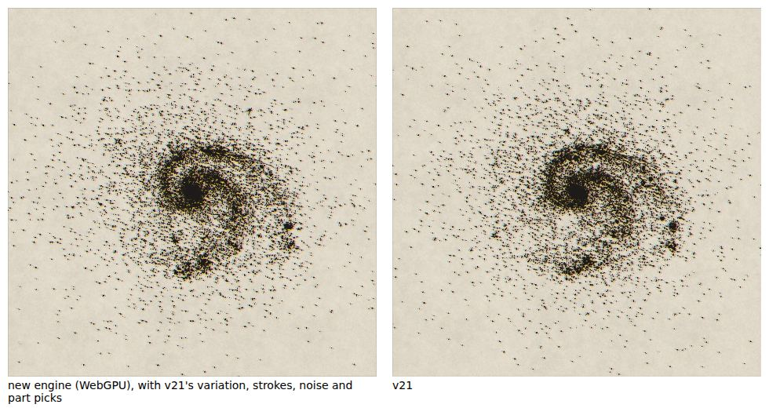
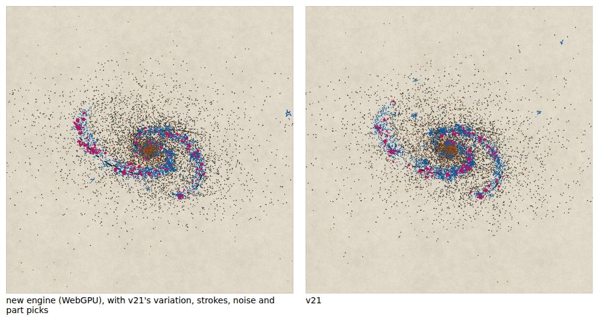
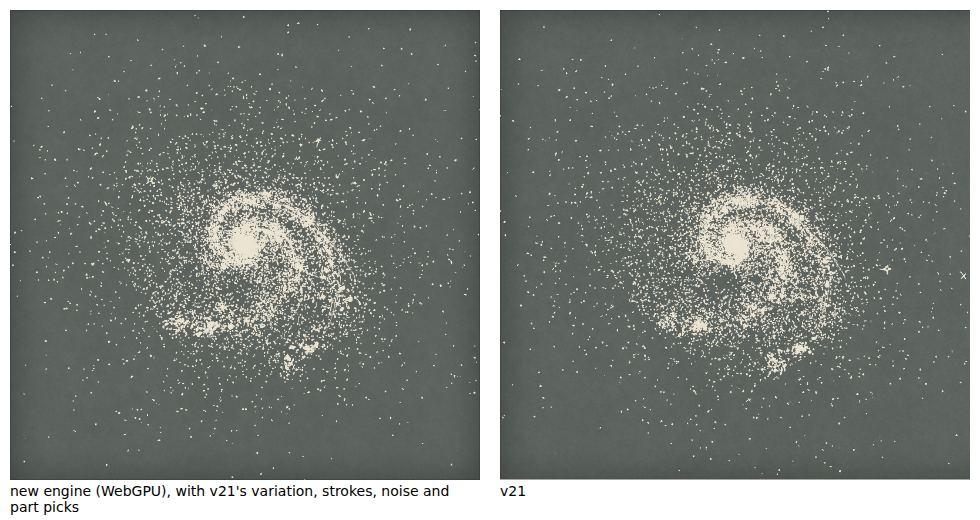

# M6: the single-galaxy preset set at parity

All 18 single-galaxy presets are drawn, and the two that print in colour print as v21 does: `Plates slipped` (three process plates, slipped and printed light, then the key ink) and `Stellar populations` (one pass, each population in its own ink), on Paper and on the Chalkboard. A diff of the engine against v21 for every preset found nothing else missing. M6 is plates, populations, goldens and the page. All numbers below are from Chromium 141 with WebGPU on SwiftShader (Playwright 1.56.1) and the CPU engine in Node 22.

| new engine (WebGPU) beside v21 | |
| --- | --- |
| `Plates slipped`, seed 7, home |  |
| `Stellar populations`, seed 4242, orbit camera |  |
| `Grand design` on the Chalkboard, seed 7, home |  |

These are drawn as the golden runner draws them, with v21's variation, stroke choices, noise and part picks, so both sides show the same galaxy; the ink is composited onto the capture's surface with its plates (`node tools/gpu-test/side-by-side.mjs --set m6`). The page draws the same presets with the engine's own picks, and has a Plates menu.

## What is built

- **Plates** (`render/plates.ts`, `render/pass-style.ts`, ADR 0024).
  - A plates mode is a list of passes, each with an ink per population, a plate offset and a gain.
    - `ink`: one pass in the key ink, as before. The target holds ink α and the composite colours it, so switching surface re-runs only the composite.
    - `slip`: four passes. Cyan at gain 0.32 and offset (−3.6, −1.2) plate units, magenta 0.3 and (3.4, 1.0), yellow 0.42 and (0.6, 3.8), then the palette's key ink at gain 1 (app23.js:L1302–1304). The process inks are the same on both surfaces.
    - `colour`: one pass. Old, disc, young and HII take the palette's own inks (lighter and warmer on the Chalkboard); the line work and the stars take the key ink (L1305).
  - The sprite, ribbon and capsule shaders take the plate offset (v21's `uOff`, added to the position before the scale). The CPU rasteriser takes it per call, in f32, and adds zero on the `ink` plate: the engine's hashes of the 124 earlier goldens are unchanged.
  - Every `InkLayer` carries its population (`pop`): the stipple's old, disc and young dots as themselves, knots as `hii`, sparkle stars and pieces as `young`, the streams' marks and the drawn core as `old`, and the line work (stroke ribbons, hatching, every vector drawing, bars, rings and arcs too) as `line`, checked against `scene()` (L1289–1301).
  - **Present tier** (ADR 0010): batches keep their instance data and make one set of uniforms per pass style, on first use. Switching plates, or surface on a coloured plate, builds a few uniform buffers and re-records one render pass. `tests/gpu/plates.ts` counts the buffers created while it switches: 114 uniform buffers over eight switches and no storage buffer, with the tier counters unchanged (`{"model":1,"view":1}` before and after). `dirtyTier` says `present` for a plates change (tests/unit/tiers.test.ts), and the CPU engine's frame runs no tier and keeps the same layers (tests/unit/plates.test.ts).
- **The page** has v21's Plates menu (ink, slipped CMY plates, colour by population), showing the preset's own plates. `tools/gpu-test/plates-page.mjs` drives it on both engines: the colour plate has coloured ink (21,645 pixels), `ink` none, the slipped plates 34,459; going back to `colour` gives the first frame's pixels exactly; no tier runs; the Chalkboard shows the lighter inks and Paper comes back to the first frame.
- **Nothing else was missing.** The diff of the engine against v21's captures for all 18 presets (below) found no gap in the stipple or the parts: Sérsic profiles, halo and envelope rules, outlines, tails, bubbles, patchy and irregular discs were built in M2 to M5. To look beyond the presets, which use few of the model's parameters, eight single-parameter probes of what no preset exercises (and M12's real galaxies do) were captured from v21 and compared: `patchy`, `irr`, `tail`, `sersicN` with `re`, `ringOnlyLines`, `dust`, `halo` with `envelope` and `outline`, and `nuclear` with `whole` and `envelope`. 31 of their 32 cases pass; the one that does not is a hair (below).

## Acceptance

### The golden set and its overrides

Roadmap M6: all 18 single-galaxy presets at seeds 7 and 4242, at the home, orbit and zoom cameras, plus the Chalkboard captures for `Grand design`. (ADR 0023, proposed.)

| set | presets | variant | cases |
| --- | --- | --- | --- |
| new in M6 | `Grand design`, `Flocculent`, `Tightly wound`, `Loose, open arms`, `Dusty spiral`, `Hand wobble`, `Smooth, round`, `Cigar-shaped`, `Plates slipped`, `Stellar populations` | `single` | 60 |
| Chalkboard | `Grand design`, `Plates slipped`, `Stellar populations` (seed 7, home and orbit) | `single` | 6 |
| M5's captures | `Barred spiral`, `Hand-drawn arms`, `Ringed`, `Disc, no arms`, `Edge-on with dust`, `Radio jet`, `Stellar streams`, `Shell galaxy` | `vectors` | 48 |
| probes | eight single parameters on `Grand design`, `Disc, no arms`, `Barred spiral` and `Smooth, round` | `knob-*` | 32 |

Every override, and why:

| override | why |
| --- | --- |
| `starMix: 0` | drawn stars among the stipple are vector `sstars` placed by `generate()` (M7). The ring knots' and clumps' drawn stars stay, because v21 draws them whatever `starMix`. Both sides classify and count them (`rstars`); they are not drawn yet |
| `field: 0`, `fgstars: 0` | the deep field and the foreground stars (the sky, M7) |
| `Shell galaxy`: `shellsOn: 0`, `shells: 1` | its simulated shells are an N-body integration (M8). Its drawn part is the `shells` sheet, which the preset leaves at 0 (as ADR 0022) |

Nothing else is overridden: no parameter of any preset is changed. M2's `lines`, `knots` and `envelope` overrides for `Smooth, round` and `Cigar-shaped`, and M4's `bubbles` override for the spirals, are gone: envelopes and bubbles are built. `Shell galaxy` is the one preset whose acceptance remains partial until M8.

### Thresholds

The metric is the one on the base, with no change to any family. One family is added, by ADR 0015's rule (ADR 0025, proposed): **`Plates slipped` is its own family, `slip`** (and `slip@zoom`). On the slipped plates v21's α is the union of four offset prints of every mark, and the same galaxy re-drawn by the engine agrees with itself less in the coarse SSIM (median 0.872 against the spirals' 0.935) than a plain plate does. The first run against `spiral` failed the three cases whose SSIM is below its band, 0.862, 0.872 and 0.813 at the zoom camera, while the engine's own re-draws scored 0.869 to 0.873. It was calibrated alone (`npm run golden -- --calibrate --only-family slip`: 18 configurations including seeds 3, 11, 5 and 19, × 3 re-keys, with every negative control), and merged into `thresholds.json` and `calibration.json` without touching any other family.

### Results

`npm run golden` on the merge with M4 (main) and M5, on SwiftShader (4,436 s), the metric as calibrated, K = 6 draws:

| set | cases | pass | CPU = WebGPU (strict) |
| --- | --- | --- | --- |
| M6 `single` (10 presets, 2 seeds, 3 cameras) | 60 | 60 | all |
| Chalkboard (`Grand design`, `Plates slipped`, `Stellar populations`) | 6 | 6 | all |
| M5 `vectors` (the other eight presets) | 48 | 45 | all |
| `knob-*` probes | 32 | 31 | all |
| M2 to M4 sets, retained | 104 | 104 | all |
| **required total** | **250** | **246** | **250** |

The 12 drawn-star gates pass. The engine's hashes (`engine-hashes.json`) are unchanged by the merge, so nothing was recalibrated.

Four cases fail, none of them in the 70 new cases of the M6 acceptance (`single` and Chalkboard):

- **Three `Edge-on with dust` cases of M5** (`s4242` home, r25 3.41% against ±3.00%; `s4242` orbit, position angle 1.53° against ±1.45°; `s7` orbit, axis ratio −0.0308 against ±0.0300). They await the owner's decision, and their thresholds are untouched.
- **One probe, `Barred spiral` with `ringOnlyLines`, seed 7, home**: r25 3.27% against ±3.00%. Every other metric is inside its band (ink 0.1%, coarse SSIM 0.946, pen 0.2%, r50 −0.6%) and the seed 4242 cases pass. It is a probe for a gap, not a roadmap case. No threshold has been changed; the owner may accept it or ask for a family calibration of the probes in a new ADR.

## Checks

| check | result |
| --- | --- |
| `npm run lint` (ESLint and Prettier) | clean |
| `npm run typecheck` | clean |
| `npm test` | 22 files, 337 tests pass (the v21 hands replay takes an explicit 60 s timeout, as the other slow tests do) |
| `npm run validate:wgsl` (naga) | all files valid |
| `npm run build` | builds |
| `npm run test:gpu` | 11 of 11 pass (including the plates, the Plates menu and the surface) |
| `npm run golden` | 246 of 250 required cases pass; strict CPU = WebGPU on all 250; 12 of 12 drawn-star gates |
