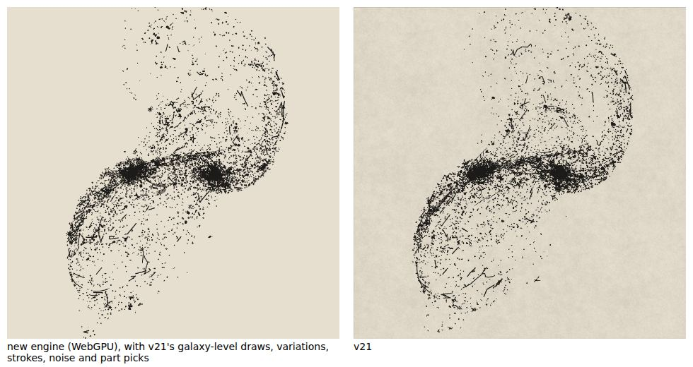
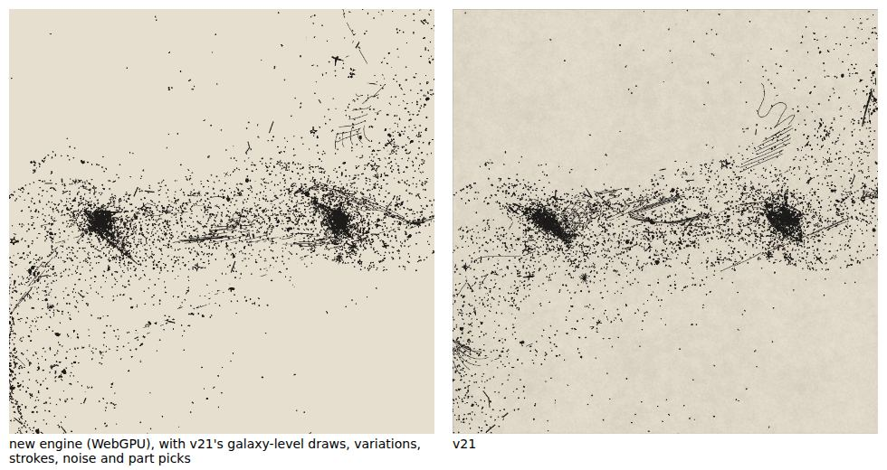
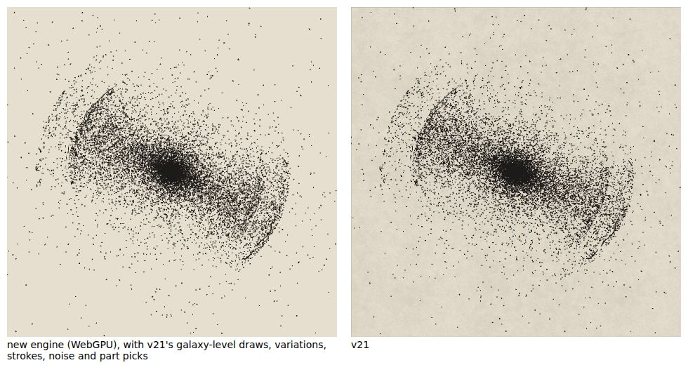

# M8: mergers

A merging pair is simulated, carried and drawn: the core track in f64 on the CPU, the test stars on the GPU with a CPU twin, snapshots for the timeline, each galaxy built as a single galaxy and torn through the tidal map, the debris as marks, `mWarp`, and the shell galaxies' satellite. All numbers below are from Chromium 141 with WebGPU on SwiftShader (Playwright 1.56.1) and the CPU engine in Node 22.

| new engine (WebGPU) beside v21 | |
| --- | --- |
| `Merger: the Mice`, seed 7, home |  |
| `Sketches, torn apart`, seed 4242, zoom 2 |  |
| `Shell galaxy` with its simulated shells, seed 7, home |  |

These are drawn as the golden runner draws them (`node tools/gpu-test/side-by-side.mjs --set m8`): with v21's galaxy-level draws, variation, stroke picks, noise and part picks, and the shells v21 found, so both sides show the same pair; the new engine's ink is shown over the plate's field colour. The test stars and every mark are the engine's own, so the tails differ in their dots, as the metric expects.

## What is built

ADRs 0040 to 0043 (proposed) give the reasons and the measurements; ADR 0044 (proposed) the goldens.

- **The core track** (`sim/merger`): v21's expressions in v21's order in f64, equal to v21's own function bit for bit on 13 cases (`npm run vectors:merger`, `tests/vectors/merger.json`).
- **The test stars** (`compute/merger.wgsl`, twin `fallback/kernels/merger.ts`): initial conditions on the counter RNG, one index per star, KDK at dt 0.012 in chunks of 200 steps; the galaxy-level draws (spin azimuth, pitch) are v21's in the goldens. Snapshots are f16 positions relative to the nearer core, two words a star, under a 64 MiB budget; the chosen moment and the horizon's end are f32. `mTime` re-blends snapshots and re-runs the view tier only (`snapAt`'s blend equals v21's to a median 9 × 10⁻⁵ galaxy units). The model tier reads back 12 kB once, for `frameOf`.
- **Each galaxy as a single galaxy, carried by the tides** (`compute/tide.wgsl`, `tide-apply.wgsl`, twin `fallback/kernels/tide.ts`): the 4 nearest test stars' warp grid, the `post` hook of the vector kernels, v21's 22 px and 1.8× tearing.
- **`mWarp`**: one whole spiral drawing per galaxy, torn through the tidal map itself (the 4 nearest stars at each densified point).
- **The debris** (`compute/merger-sprites.wgsl`, twin `fallback/kernels/merger-sprites.ts`): classified on the counter RNG and thinned as v21 thins it. What v21 builds and never draws (the cores' bulge stipple) is not built.
- **Shell galaxies** (`compute/shells.wgsl`, twin `fallback/kernels/shells.ts`): the satellite integrated on the GPU, its shells found by integer atomics and a bisection (one read-back), the arcs as ribbons through a face-on camera.
- **v21 parity** (`// v21 parity:`, Q13): the shells are a fixed two-dimensional image that follows neither the inclination, azimuth nor position angle, only `shellAxis`, and `RMAX` is 240 at run time so no truncation fires (`sim/shells.ts`, reference notes 20.14 and 20.7); a merging galaxy takes everything not overridden from the main picture (`mergerGalaxyParams`, reference notes 20.20); the simulated bulge stipple, the cores' screen positions and the merger's `cores` list are not built, because v21 never draws them (reference notes 20.9). The breathing room that compares warped dots with unwarped stars in a merger galaxy (reference notes 20.8) belongs with the drawn stars, M7.

## Acceptance

### The golden set and its overrides

Roadmap M8: the eight `Merger: …` presets and `Sketches, torn apart`, seeds 7 and 4242, home, orbit and zoom (54 cases). The set also holds `Layered: lensed merger` with its lens off (M9's preset, drawn as a merger), the Mice at `mTime` 0.5 and 1.5 (the timeline), and `Shell galaxy` with its simulated shells: 78 required cases in all, 72 mergers and 6 shells, variants `mergers`, `mergers-t05`, `mergers-t15` and `shells` (`tests/golden/extra-cases.json`). The overrides are ADR 0016's and ADR 0022's `starMix: 0`, `field: 0`, `fgstars: 0` (drawn stars and the sky are M7) and `lensOn: 0` for the lensed merger (ADR 0044, proposed).

The comparison draws with v21's discrete choices (ADR 0018): each galaxy's spin and pitch, variation, stroke, noise and part picks, `mWarp`'s two drawings, and the shells v21 found. The test stars' initial conditions and every mark are the engine's own and are re-keyed by the placement key, so the mean of K = 6 draws is compared with v21's single draw.

### Thresholds

The merger family (`merger`, `merger@zoom`) had only the provisional placeholders of ADR 0015. Against them 29 of the 72 captures failed, 28 on coarse SSIM alone (0.79–0.85), because a merger's tails and remnant are one random realisation. It is calibrated by ADR 0018's rule on 72 configurations, K = 6, three stand-ins each and every negative control, with two additions that ADR 0044 proposes: the moment tolerances are no smaller than 1.1 × the largest of the family's own re-draw pairs, and a merger preset's coarse SSIM floor is its own where lower (`Merger: coalescing`, whose remnant two engine draws reproduce to only 0.79–0.82). The shells are a family of their own, calibrated on 12 held-out v21 captures (seeds 3, 11, 23, 101) as well. The values and what the controls catch are in ADR 0044 and `calibration.json`.

### Results (WebGPU against v21; the CPU engine gives the same numbers)

| case | ink | coarse SSIM | median | p90 | r50 | dots / knots / stars / rstars | result |
| --- | --- | --- | --- | --- | --- | --- | --- |
| layered-lensed-merger s4242 home | -3.2% | 0.872 | -0.2% | -2.1% | -4.6% | 7674/7610 168/207 34/33 2/8 | pass |
| layered-lensed-merger s4242 orbit | -2.6% | 0.873 | -0.3% | -0.7% | -4.1% | 7674/7610 168/207 34/33 2/8 | pass |
| layered-lensed-merger s4242 zoom | +1.1% | 0.865 | +0.1% | +3.3% | -2.2% | 7674/7610 168/207 34/33 2/8 | pass |
| layered-lensed-merger s7 home | +3.0% | 0.845 | -0.2% | -0.1% | +2.2% | 7597/7618 171/157 34/46 3/4 | pass |
| layered-lensed-merger s7 orbit | +1.7% | 0.854 | +0.0% | +1.7% | +1.1% | 7597/7618 171/157 34/46 3/4 | pass |
| layered-lensed-merger s7 zoom | +0.8% | 0.851 | +0.0% | -2.6% | +1.8% | 7597/7618 171/157 34/46 3/4 | pass |
| merger-coalescing s4242 home | -0.4% | 0.788 | +0.1% | +2.2% | -1.3% | 7751/7704 380/345 39/40 12/17 | pass |
| merger-coalescing s4242 orbit | +0.5% | 0.806 | -0.7% | +0.5% | -4.0% | 7751/7704 380/345 39/40 12/17 | pass |
| merger-coalescing s4242 zoom | -0.4% | 0.789 | -0.7% | -2.4% | +2.3% | 7751/7704 380/345 39/40 12/17 | pass |
| merger-coalescing s7 home | -0.8% | 0.787 | +0.1% | -1.5% | -0.6% | 7766/7742 417/426 38/45 15/13 | pass |
| merger-coalescing s7 orbit | -1.1% | 0.794 | -0.2% | -1.6% | -3.3% | 7766/7742 417/426 38/45 15/13 | pass |
| merger-coalescing s7 zoom | +0.9% | 0.808 | -0.0% | +1.4% | -0.7% | 7766/7742 417/426 38/45 15/13 | pass |
| merger-dry-two-ellipticals s4242 home | +1.0% | 0.899 | +0.0% | -2.2% | +0.9% | 7562/7515 0/0 25/25 0/0 | pass |
| merger-dry-two-ellipticals s4242 orbit | -0.1% | 0.897 | +0.1% | +1.3% | +1.0% | 7562/7515 0/0 25/25 0/0 | pass |
| merger-dry-two-ellipticals s4242 zoom | +1.2% | 0.862 | -0.2% | +0.3% | +0.2% | 7562/7515 0/0 25/25 0/0 | pass |
| merger-dry-two-ellipticals s7 home | +1.9% | 0.884 | +1.5% | +4.3% | -2.2% | 7560/7587 0/0 27/30 0/0 | pass |
| merger-dry-two-ellipticals s7 orbit | +2.8% | 0.890 | +0.1% | +2.2% | -0.3% | 7560/7587 0/0 27/30 0/0 | pass |
| merger-dry-two-ellipticals s7 zoom | +0.7% | 0.856 | +0.1% | +1.1% | -2.3% | 7560/7587 0/0 27/30 0/0 | pass |
| merger-long-tails s4242 home | +1.3% | 0.842 | +1.8% | +0.9% | +1.2% | 7750/7718 284/258 40/42 5/6 | pass |
| merger-long-tails s4242 orbit | +3.1% | 0.855 | -1.2% | +4.0% | +0.6% | 7750/7718 284/258 40/42 5/6 | pass |
| merger-long-tails s4242 zoom | -0.4% | 0.787 | +0.3% | -0.8% | -0.2% | 7750/7718 284/258 40/42 5/6 | pass |
| merger-long-tails s7 home | +1.8% | 0.838 | -0.8% | -2.5% | +0.4% | 7768/7757 332/363 38/43 5/4 | pass |
| merger-long-tails s7 orbit | +3.1% | 0.842 | -0.1% | +1.9% | -2.2% | 7768/7757 332/363 38/43 5/4 | pass |
| merger-long-tails s7 zoom | -1.5% | 0.837 | -0.3% | -4.3% | +0.1% | 7768/7757 332/363 38/43 5/4 | pass |
| merger-minor-a-stream s4242 home | +4.3% | 0.866 | -3.1% | -2.0% | -2.6% | 7756/7701 279/255 42/41 3/1 | pass |
| merger-minor-a-stream s4242 orbit | +3.3% | 0.872 | -0.1% | -0.2% | -1.9% | 7756/7701 279/255 42/41 3/1 | pass |
| merger-minor-a-stream s4242 zoom | +3.8% | 0.832 | -0.6% | -1.4% | -2.7% | 7756/7701 279/255 42/41 3/1 | pass |
| merger-minor-a-stream s7 home | -0.3% | 0.847 | +0.0% | -2.7% | -1.9% | 7773/7792 322/307 38/46 4/2 | pass |
| merger-minor-a-stream s7 orbit | +1.5% | 0.848 | -2.0% | -0.7% | -2.1% | 7773/7792 322/307 38/46 4/2 | pass |
| merger-minor-a-stream s7 zoom | +0.7% | 0.790 | +0.1% | +1.9% | -1.3% | 7773/7792 322/307 38/46 4/2 | pass |
| merger-polar-collision s4242 home | +2.1% | 0.899 | +0.7% | +3.1% | +1.3% | 7668/7629 254/233 41/37 3/2 | pass |
| merger-polar-collision s4242 orbit | +1.8% | 0.894 | +0.6% | +2.8% | +1.8% | 7668/7629 254/233 41/37 3/2 | pass |
| merger-polar-collision s4242 zoom | +1.5% | 0.804 | -0.4% | -1.4% | +0.3% | 7668/7629 254/233 41/37 3/2 | pass |
| merger-polar-collision s7 home | -1.5% | 0.889 | +0.3% | -2.0% | +0.5% | 7752/7770 260/282 40/42 1/1 | pass |
| merger-polar-collision s7 orbit | -1.3% | 0.913 | -2.4% | -2.1% | +1.0% | 7752/7770 260/282 40/42 1/1 | pass |
| merger-polar-collision s7 zoom | -1.3% | 0.822 | -0.2% | -1.3% | -1.0% | 7752/7770 260/282 40/42 1/1 | pass |
| merger-spiral-meets-elliptical s4242 home | +0.1% | 0.895 | -0.3% | -0.6% | +2.1% | 7677/7636 189/175 34/34 5/8 | pass |
| merger-spiral-meets-elliptical s4242 orbit | -0.3% | 0.910 | +0.4% | +1.5% | +0.2% | 7677/7636 189/175 34/34 5/8 | pass |
| merger-spiral-meets-elliptical s4242 zoom | -1.1% | 0.850 | +5.8% | +2.5% | -0.3% | 7677/7636 189/175 34/34 5/8 | pass |
| merger-spiral-meets-elliptical s7 home | -2.0% | 0.870 | +0.8% | +0.2% | -2.0% | 7603/7619 184/178 34/45 5/6 | pass |
| merger-spiral-meets-elliptical s7 orbit | -1.1% | 0.863 | -0.2% | +1.2% | +0.1% | 7603/7619 184/178 34/45 5/6 | pass |
| merger-spiral-meets-elliptical s7 zoom | -3.8% | 0.825 | +0.0% | +0.5% | -3.4% | 7603/7619 184/178 34/45 5/6 | pass |
| merger-the-mice s4242 home | +1.2% | 0.882 | -1.4% | -0.9% | +0.5% | 7750/7708 303/275 39/35 6/7 | pass |
| merger-the-mice s4242 orbit | +1.6% | 0.886 | -1.7% | -1.3% | +1.7% | 7750/7708 303/275 39/35 6/7 | pass |
| merger-the-mice s4242 zoom | -0.2% | 0.819 | +0.4% | -1.2% | +0.2% | 7750/7708 303/275 39/35 6/7 | pass |
| merger-the-mice s7 home | +0.3% | 0.872 | +0.9% | -0.4% | +3.2% | 7765/7780 360/324 39/51 8/6 | pass |
| merger-the-mice s7 orbit | -0.7% | 0.879 | +0.3% | -0.1% | +3.7% | 7765/7780 360/324 39/51 8/6 | pass |
| merger-the-mice s7 zoom | -2.8% | 0.832 | -0.0% | -1.8% | +0.7% | 7765/7780 360/324 39/51 8/6 | pass |
| merger-the-mice (t05) s4242 home | +2.1% | 0.932 | +0.9% | +0.8% | +0.1% | 7751/7704 247/236 39/42 0/0 | pass |
| merger-the-mice (t05) s4242 orbit | +2.0% | 0.956 | +1.6% | +7.6% | +0.1% | 7751/7704 247/236 39/42 0/0 | pass |
| merger-the-mice (t05) s4242 zoom | +2.1% | 0.870 | +0.2% | -1.4% | +0.4% | 7751/7704 247/236 39/42 0/0 | pass |
| merger-the-mice (t05) s7 home | -0.3% | 0.947 | +1.1% | +1.8% | +0.5% | 7766/7778 289/293 39/48 0/0 | pass |
| merger-the-mice (t05) s7 orbit | -0.2% | 0.954 | -3.4% | -1.3% | +0.4% | 7766/7778 289/293 39/48 0/0 | pass |
| merger-the-mice (t05) s7 zoom | -2.0% | 0.858 | -0.2% | +0.5% | +0.3% | 7766/7778 289/293 39/48 0/0 | pass |
| merger-the-mice (t15) s4242 home | -1.0% | 0.864 | -0.4% | -5.5% | -1.1% | 7749/7703 392/368 39/37 14/15 | pass |
| merger-the-mice (t15) s4242 orbit | -0.7% | 0.870 | -2.0% | -5.7% | -2.3% | 7749/7703 392/368 39/37 14/15 | pass |
| merger-the-mice (t15) s4242 zoom | -4.4% | 0.823 | +4.2% | +6.3% | -1.2% | 7749/7703 392/368 39/37 14/15 | pass |
| merger-the-mice (t15) s7 home | -3.2% | 0.817 | +1.3% | +1.8% | -0.6% | 7764/7777 441/414 39/47 17/17 | pass |
| merger-the-mice (t15) s7 orbit | -3.0% | 0.862 | +1.4% | -0.1% | -1.2% | 7764/7777 441/414 39/47 17/17 | pass |
| merger-the-mice (t15) s7 zoom | -3.3% | 0.820 | +1.7% | +1.8% | -0.4% | 7764/7777 441/414 39/47 17/17 | pass |
| merger-three-armed-pair s4242 home | +0.3% | 0.867 | +2.4% | +1.3% | +0.5% | 7674/7645 236/207 37/39 4/3 | pass |
| merger-three-armed-pair s4242 orbit | +0.9% | 0.857 | +4.0% | +3.5% | -0.7% | 7674/7645 236/207 37/39 4/3 | pass |
| merger-three-armed-pair s4242 zoom | -0.9% | 0.829 | +0.9% | +4.1% | -1.5% | 7674/7645 236/207 37/39 4/3 | pass |
| merger-three-armed-pair s7 home | -2.4% | 0.859 | -0.6% | -1.9% | +1.3% | 7590/7594 219/200 38/48 6/2 | pass |
| merger-three-armed-pair s7 orbit | -2.2% | 0.857 | +1.6% | -0.4% | +1.7% | 7590/7594 219/200 38/48 6/2 | pass |
| merger-three-armed-pair s7 zoom | -1.8% | 0.809 | -3.4% | -3.7% | +1.0% | 7590/7594 219/200 38/48 6/2 | pass |
| shell-galaxy (shells) s4242 home | +1.5% | 0.946 | +0.4% | -0.2% | +0.4% | 15000/15000 0/0 0/0 0/0 | pass |
| shell-galaxy (shells) s4242 orbit | +1.5% | 0.947 | +0.4% | -0.0% | +0.5% | 15000/15000 0/0 0/0 0/0 | pass |
| shell-galaxy (shells) s4242 zoom | +1.3% | 0.918 | -0.2% | -0.7% | +2.8% | 15000/15000 0/0 0/0 0/0 | pass |
| shell-galaxy (shells) s7 home | +1.2% | 0.947 | +1.1% | +1.4% | +2.4% | 15000/15000 0/0 0/0 0/0 | pass |
| shell-galaxy (shells) s7 orbit | +1.3% | 0.947 | +1.4% | +1.2% | +1.9% | 15000/15000 0/0 0/0 0/0 | pass |
| shell-galaxy (shells) s7 zoom | +1.1% | 0.912 | +0.1% | +1.3% | +1.4% | 15000/15000 0/0 0/0 0/0 | pass |
| sketches-torn-apart s4242 home | +0.7% | 0.875 | -0.2% | -1.7% | +1.1% | 7750/7704 332/298 39/38 9/7 | pass |
| sketches-torn-apart s4242 orbit | +0.5% | 0.881 | +1.6% | +1.4% | -1.0% | 7750/7704 332/298 39/38 9/7 | pass |
| sketches-torn-apart s4242 zoom | -0.4% | 0.815 | +0.9% | -0.4% | +1.9% | 7750/7704 332/298 39/38 9/7 | pass |
| sketches-torn-apart s7 home | -0.5% | 0.856 | +0.4% | -0.1% | +2.1% | 7765/7780 387/349 39/40 12/9 | pass |
| sketches-torn-apart s7 orbit | -0.2% | 0.863 | -0.5% | -1.9% | +1.4% | 7765/7780 387/349 39/40 12/9 | pass |
| sketches-torn-apart s7 zoom | -3.2% | 0.832 | -0.1% | -2.8% | +0.7% | 7765/7780 387/349 39/40 12/9 | pass |

**227 of the 230 required cases pass, and all 78 M8 cases** (each against the mean of 6 draws, ADR 0018; the CPU engine gives the same numbers; the drawn-star gates 40 of 40). The three that fail are M5's `Edge-on with dust` cases, which wait for the owner (docs/milestones/m5/README.md); their thresholds are untouched. The engine hashes of the 78 M8 cases are recorded (test e); WebGPU rendered twice is bit-identical on every case (L0).

Two things the table shows plainly:

- The coarse SSIM of a merger is lower than a galaxy's (0.79–0.96 against 0.91–0.99 for the M5 set): the metric sees the random tails. At the zoom camera, where the plate holds the inner 2.4 units, it is 0.79–0.87.
- `rstars` differ more than the other counts (`Layered: lensed merger` s4242: 2 against 8): the drawn stars among the debris are the engine's own draw, counted but not drawn until M7, and they stay inside the Poisson allowance.

### CPU engine against WebGPU (L1)

`npm run golden`, strict: all 230 cases pass; on the 78 M8 cases the worst differences are ink 0.02%, median width 0.2%, p90 width 0.3% and coarse SSIM 0.9999, with identical counts.

### Test-star drift (`npm run test:gpu`, `tests/gpu/merger.ts`)

The GPU (SwiftShader) against the CPU twin, 9 cases of about 9,700 stars (ADR 0040 item 6 has the full table). Positions in plate px at the Mice's framing:

| | median | p99.9 | share within 0.05 px |
| --- | --- | --- | --- |
| initial conditions (disc coordinates), all 9 cases | 0 | ≤ 7.7 × 10⁻⁵ | 100% |
| the chosen moment, 8 cases | 0 | 0.008–0.058 | 99.94–100% |
| the chosen moment, `coalescing` (stage 4.5, friction 0.8) | 0 | 0.15 (worst star 0.79) | 99.43% |
| tails, 8 cases | 0 | ≤ 0.063 | 99.75–100% |
| the horizon's end, quiet cases | 0 | 0.03–0.22 | 99.5–99.96% |
| the horizon's end, stars orbiting a merged pair for hundreds of steps | 0 | 42 (`coalescing`), 0.95 (the Mice, horizon 6) | 87.2%, 95.8% |

- ADR 0004's L1 (99.9% within 0.05 px) holds at the chosen moment in 8 of 9 cases; `coalescing` and the long horizons are chaotic by nature, and their drift is reported, not hidden. The goldens do not depend on individual stars: the CPU engine against WebGPU passes at the strict thresholds on every merger case.
- **Not measured: a real GPU.** This machine has none (SwiftShader only), so the roadmap's "and one real GPU" is open. `ROSSE_WEBGPU_ADAPTER=default npm run test:gpu` runs the same test on the machine's own adapter (`discrete` and `integrated` pick one); the report lists its name. That is an owner action.

## Owner decisions

1. **The three `Edge-on with dust` cases** (M5, unchanged): s4242 home r25 +3.41% (±3.00%), s4242 orbit position angle 1.53° (±1.45°), s7 orbit axis ratio −0.0308 (±0.0300).
2. **ADR 0044**: the M8 overrides, the largest-pair floor of the merger tolerances, the merger preset's own coarse SSIM floor, and the shell family. Without the largest-pair floor, the two `Layered: lensed merger` s4242 cases (home and orbit) fail r25 by 0.35 points (−6.35% against ±6.00%); that preset is M9's.
3. **ADRs 0040 to 0043** (proposed): the snapshot budget and the one read-back, the carried galaxy, the debris, the shells.
4. **A real GPU's drift** (above).

## Not done, or left for later

- **Drawn stars and the sky are M7**: the debris's and the clumps' drawn stars, the deep field, foreground stars and trails of the whole picture. The breathing room that clears dots near bright stars belongs with them.
- **The lens of the merged scene is M9**; `Layered: lensed merger` is a regression case here.
- **The 4-NN warp.** The tidal map takes each point's 4 nearest test stars of the engine's own draw, so which pieces of `mWarp`'s drawings survive v21's 22 px rule differ from v21's (compare the torn drawings of `Sketches, torn apart` in the image above); the comparison's re-keyed draws carry this spread, but it is not characterised on its own.
- **Chaotic horizons.** A merged pair's stars on tight orbits drift more than L1 over hundreds of steps (above); a horizon of 30 is chunked so a frame never stalls (M10 profiles it).

## Checks

| check | result |
| --- | --- |
| `npm run lint` (ESLint and Prettier) | clean |
| `npm run typecheck` | clean |
| `npm test` | 27 files, 395 tests pass |
| `npm run validate:wgsl` | 25 of 25 WGSL files valid |
| `npm run build` | passes |
| `npm run test:gpu` | 12 of 12 checks pass (SwiftShader) |
| `npm run golden` | 227 of 230 required cases pass; 40 of 40 drawn-star gates; the 3 failures are M5's `Edge-on with dust` |
