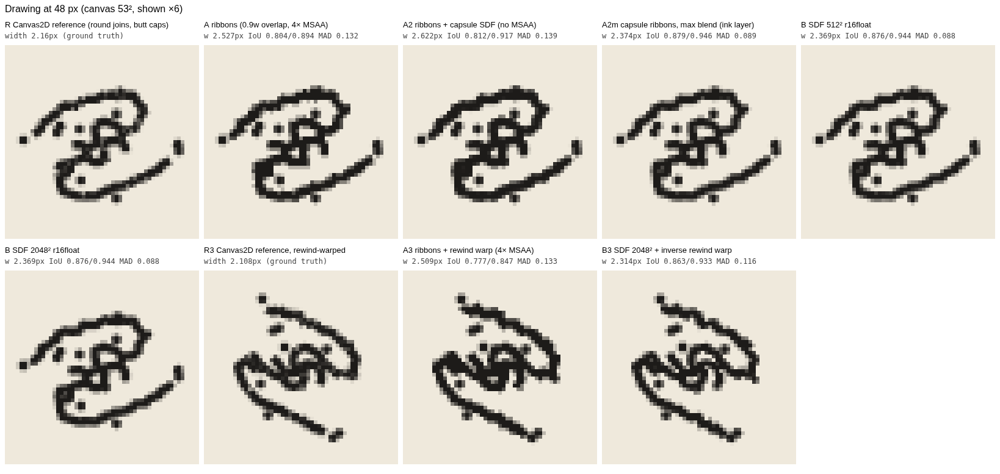
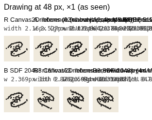
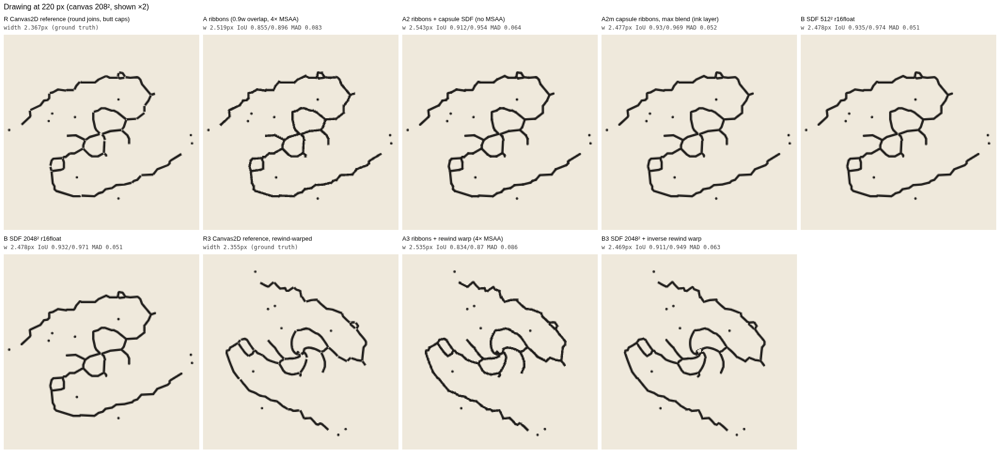
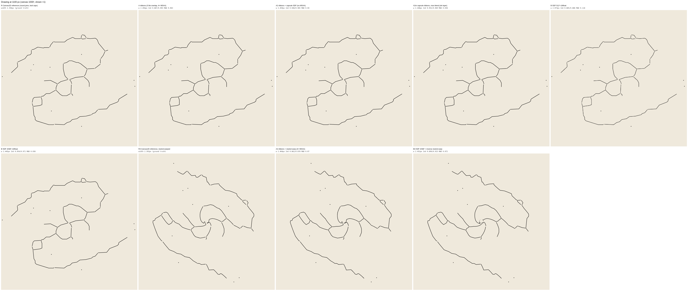
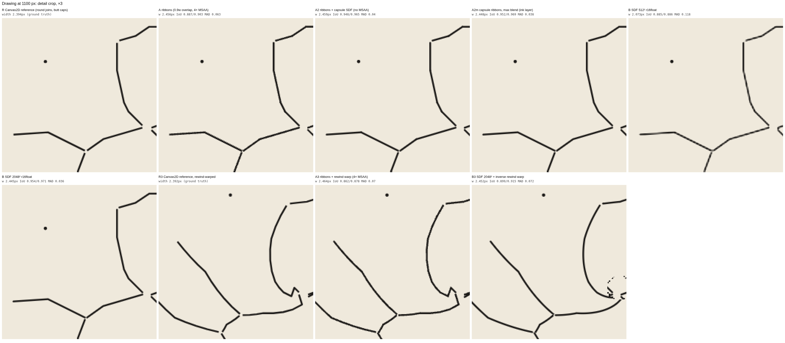

# Vector pen lines on WebGPU: ribbons vs distance fields (throwaway spike)

> Throwaway. Answers one question for the WebGPU/WGSL rewrite: should the vector drawings (`l` polylines, `d` dots) be drawn as
> GPU-expanded pen **ribbons** or sampled from **distance-field textures**, given that the pen must keep the same weight
> (half-width w = 1.2 px for pen 2.4) whatever size a drawing is placed at, and that drawings may be warped non-affinely?

## Conclusion

**Ribbons, for every vector drawing. No SDF textures.**

* **Fidelity:** capsule ribbons (A2) match the Canvas2D reference as well as a 2048² SDF at every size (IoU ≈ 0.95–0.97 against round-cap strokes at 220 and 1100 px). The SDF only does that at 2048², i.e. 8 MB per drawing. At 512² it thins the line at 1100 px (−13 % ink, broken-looking strokes): 1.2 px half-width is 0.0011 tile units, less than one 1/512 texel, and bilinear filtering of an unsigned distance rounds the V-shaped minimum off.
* **Warps:** ribbons take the rewind warp per vertex at no extra cost (A3 = A + 3× vertices from the ≤0.012 densification). The SDF could be warped only because this warp happens to have an analytic inverse. Even then it needed a Jacobian-along-gradient correction in the fragment shader, ran 3.7× slower than the unwarped SDF and 14× slower than the warped ribbons on a big drawing, and broke up near the warp's singular centre. Lens Jacobians and tidal warps have no cheap inverse, so the SDF route rules them out.
* **Memory:** the whole library (429 drawings, 23 431 segments) is **375 KB** as `vec4<f32>` segments. As SDFs it is **225 MB** at 512² and **3.6 GB** at 2048² (r16float, no mips).
* **Cost:** on this CPU rasteriser one big drawing is 20–26× cheaper as ribbons (no MSAA), because an SDF shades its whole tile quad. In a deep field of 6000 marks at 48 px, 512² SDF quads were *cheaper*: 2.3× cheaper than A2 and 4.5× cheaper than A. The 2048² SDF cost about the same as A2, because ribbons push 4 M vertices through a software vertex pipeline. That is the one result that favours SDFs, and it is the one SwiftShader exaggerates most (see caveat). The fix to plan for is a ribbon LOD (decimate polylines to ~0.5–1 px screen tolerance for tiny instances; at 48 px the mean segment is only 1.3 px long), not a second rendering technique.
* **Ribbon flavour:** prefer **A2** (quad padded 1 px, analytic capsule coverage `clamp(w + 0.5 − dist, 0, 1)`, no MSAA) over the reference's A (0.9w overlap + 4× MSAA). A2 is more faithful (IoU 0.95 vs 0.89 at 1100 px), needs no 4× MSAA target (41 MB at 1600²), and was 2–5× cheaper here. With over-blending, A2's anti-aliased fringes stack at joins and fatten tiny drawings (+8 % ink at 48 px). **A2m** fixes that by rendering ink coverage into its own layer with `max` blending (exact union, same quality as the SDF at 48 px), then compositing the layer onto paper.

So the SDF is not even needed as a small-mark LOD. Its fidelity advantage at 48 px comes entirely from the exact union, and A2m reproduces that. Re-check only the deep-field vertex cost on real hardware (see "On real hardware").

## What was built

`index.html` + `spike.js` (plain ES modules, WebGPU, no deps), `run.mjs` (Node server + headless Playwright Chromium, SwiftShader WebGPU).
Drawing: `assets/drawings/vector/whole.json` → `vec[0]` (AB-1, barred spiral): 39 polylines, 110 segments, 9 dots, 0 blobs, centreline 3.058 tile units; 314 segments after ≤0.012 densification.

| key | method |
|---|---|
| R | Canvas2D ground truth: one path per polyline, lineWidth 2.4, **round joins, butt caps**. Fidelity is also reported against the same strokes with round caps (second number), which is the fairer reference for the round-ended methods (A2, A2m, B). |
| A | WGSL ribbons as in the reference: segments in a storage buffer, vertex pulling (`draw(nSeg*6, nInst)`, segment = `vertex_index/6`), expanded in plate px after the per-instance 2×2 + translation, 0.9w overlap, no caps, solid alpha, 4× MSAA, premultiplied ONE / ONE_MINUS_SRC_ALPHA. |
| A2 | Same ribbons, quad padded to w+1 px on all sides, fragment computes capsule distance; coverage `clamp(w+0.5−d,0,1)`; no MSAA. |
| A2m | A2 with `max` blending (ink-coverage layer; a union, not "over"). |
| B512 / B2048 | Unsigned distance to the centrelines baked on the CPU (per-segment rasterised, clamped at 0.04 tile) into r16float (filterable by default), one quad per instance, bilinear sample, `d_px = d_tile × size`, same coverage. Bake time: 13 ms (512²), 55 ms (2048²) in JS. |
| A3 | A with the reference rewind warp (`θ += 0.6·ln(r/0.08)`) applied per vertex in the vertex shader to the densified segments. |
| B3 | B2048 under the same warp, through its analytic inverse; tile distance → px via the local screen→tile Jacobian (`dpdx/dpdy`) projected on the field's gradient. |
| R3 | Canvas2D reference of the warped (densified) polylines. |

Dots (`d`) are drawn the same way for every GPU method: analytic filled circles with radius `clamp(r·size·0.5, 1.3, 2.2)` px, a stand-in for the dots-atlas sprites. They are left out of all fidelity measurements and timings. Blobs: this drawing has none.
GPU panels are rendered into an offscreen `rgba8unorm` texture cleared to transparent and read back. The alpha is used for the metrics and composited on paper `#efe9dc` for display.

## Screenshots

* 48 px, ×6: 
* 48 px, actual size: 
* 220 px, ×2: 
* 1100 px, actual size: 
* 1100 px, detail ×3 (look at B512's broken, thinner strokes and B3's break-up near the centre): 
* Whole page: [screenshots/full-page.png](screenshots/full-page.png)

## Fidelity (lines only, vs Canvas2D)

Mean width = ink area / centreline length (px). The ends and joins inflate it at small sizes, where the mean segment is only 1.3 px. IoU is measured at α ≥ 0.5; MAD = mean |Δα| over pixels with any ink. Each cell gives the value against the butt-cap reference / the round-cap reference.

| size | method | width px (ref: 2.16/2.43 @48, 2.37/2.47 @220, 2.39/2.44 @1100) | IoU | MAD |
|---|---|---|---|---|
| 48 | A | 2.53 | 0.80 / 0.89 | 0.13 / 0.07 |
| 48 | A2 | 2.62 | 0.81 / 0.92 | 0.14 / 0.06 |
| 48 | A2m | 2.37 | 0.88 / **0.95** | 0.09 / 0.04 |
| 48 | B512 | 2.37 | 0.88 / **0.94** | 0.09 / 0.04 |
| 48 | B2048 | 2.37 | 0.88 / **0.94** | 0.09 / 0.04 |
| 220 | A | 2.52 | 0.86 / 0.90 | 0.08 / 0.06 |
| 220 | A2 | 2.54 | 0.91 / 0.95 | 0.06 / 0.04 |
| 220 | A2m | 2.48 | 0.93 / **0.97** | 0.05 / 0.03 |
| 220 | B512 | 2.48 | 0.94 / **0.97** | 0.05 / 0.03 |
| 220 | B2048 | 2.48 | 0.93 / **0.97** | 0.05 / 0.03 |
| 1100 | A | 2.46 | 0.89 / 0.90 | 0.06 / 0.05 |
| 1100 | A2 | 2.46 | 0.95 / **0.97** | 0.04 / 0.03 |
| 1100 | A2m | 2.45 | 0.95 / **0.97** | 0.04 / 0.03 |
| 1100 | B512 | **2.07 (thin)** | 0.89 / 0.89 | 0.12 / 0.12 |
| 1100 | B2048 | 2.45 | 0.95 / **0.97** | 0.04 / 0.02 |

Warped (vs R3; ref width 2.11/2.36 @48, 2.36/2.46 @220, 2.39/2.44 @1100):

| size | method | width px | IoU | MAD |
|---|---|---|---|---|
| 48 | A3 | 2.51 | 0.78 / 0.85 | 0.13 / 0.07 |
| 48 | B3 | 2.31 | 0.86 / 0.93 | 0.12 / 0.06 |
| 220 | A3 | 2.54 | 0.83 / 0.87 | 0.09 / 0.06 |
| 220 | B3 | 2.47 | 0.91 / 0.95 | 0.06 / 0.04 |
| 1100 | A3 | 2.46 | 0.86 / 0.88 | 0.07 / 0.06 |
| 1100 | B3 | 2.45 | 0.90 / 0.92 | 0.07 / 0.06 |

(A3 uses A's MSAA-quad style; an A2-style warped ribbon would score like A2. B3 scores well on these averages, but look at the detail crop: it breaks up near the warp centre. It also needed a first fix: the clamped field leaked a grey haze wherever the warp compresses space, until texels at the clamp were treated as "no ink".)

What you can see in the images: there is no SDF "merging" of nearby lines at 48 px. An unsigned field gives the same union as the strokes, and at 48 px every method fills in the bar's knot about equally. A and A2 come out visibly heavier than the reference at 48 px (end extensions and stacked fringes). B512 at 1100 px is thinner and looks beaded. A's MSAA edges are coarser than the analytic ones.

## Timings

SwiftShader in headless Chromium 141, 1600² plate, lines only, no dots. N=1 is the drawing at 1100 px. N=1000/6000 are random positions and rotations at 48 px (a deep field), drawn from one instance buffer.
Wall = submit → `onSubmittedWorkDone`. GPU = timestamp-query around the pass (supported here). 5–60 frames per case (capped at ~4 s). Timings varied by about ±20–40 % between runs.

| method | N=1 (1100 px) GPU ms | N=1000 (48 px) GPU ms | N=6000 (48 px) GPU ms | vertices at 6000 |
|---|---|---|---|---|
| A (MSAA 4×) | 6.2 | 407 | 2447 | 3.96 M |
| A2 | **1.2** | 210 | 1236 | 3.96 M |
| A2m | 1.3 | 217 | 1647 | 3.96 M |
| B512 | 23.7 | **75** | **541** | 36 k |
| B2048 | 30.8 | 118 | 1126 | 36 k |
| A3 (warp) | 8.0 | 1015 | 7144 | 11.3 M |
| B3 (warp) | 114 | 330 | 3002 | 36 k |

Wall-clock means are within a few % of these (see `results.json`).

**Caveat:** SwiftShader is a CPU software rasteriser. Absolute numbers are not GPU numbers, and it is especially slow at vertex processing and MSAA, so it penalises ribbons in the deep field and A's MSAA more than real hardware would. Treat only the relative costs and the fidelity as informative. On a real GPU, 4 M vertices of simple vertex pulling is on the order of a millisecond. The deep-field question (ribbons at N=6000) must be re-measured on real hardware, and the ribbon LOD (screen-space decimation of the polylines) built anyway.

## Memory

| what | this drawing | all 429 vector drawings |
|---|---|---|
| segments `vec4<f32>` (ribbons) | 1 760 B | 374 896 B (23 431 segments) |
| polyline points `vec2<f32>` (alternative layout) | 1 192 B | 228 080 B (28 510 points) |
| densified segments for warps (≤0.012) | 5 024 B | (can be produced on the fly) |
| SDF 512² r16float | 524 288 B (699 KB with mips) | 225 MB |
| SDF 2048² r16float | 8 388 608 B (11.2 MB with mips) | 3.6 GB |
| 1600² colour target / 4× MSAA target | 10.2 MB / +41 MB (A only) | — |

Library counts are computed from `assets/drawings/vector/*.json`: whole 156, arms 44, rings 51, bars 10, env 21, arcs 15, shells 5, companions 10, trails 13, penlines 25, sstars 77, misc 2 = **429 drawings**, 23 431 segments, 6 038 dots, 328 blobs.

## On real hardware

From the repo root, `npx serve` (or any static server on `http://localhost`, since WebGPU needs a secure context), then open `http://localhost:3000/spikes/vector-lines/`. The page shows the comparison grids, then runs the timing harness (about a minute) and fills in the tables. `node spikes/vector-lines/run.mjs` reproduces everything headless with SwiftShader.

## Problems and loose ends

* Dots are analytic circles, not dots-atlas sprites. Blobs are not drawn (this drawing has none).
* Rewind warp: the reference's `r < 0.015` cut-off is a discontinuity. A3 shows a small stray mark there, as the reference would. B3 breaks up near it.
* The fidelity reference is Chromium's Canvas2D (Skia), not the original WebGL output. The reference look is A, so A's IoU of about 0.89 is the gap between the reference engine and an ideal pen, not an error in A.
